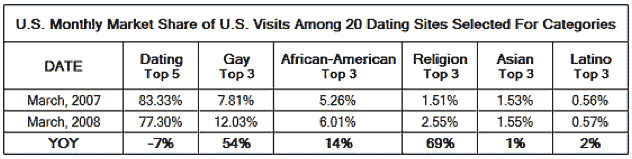
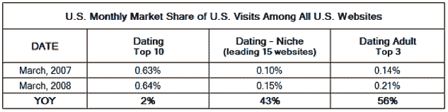

# 小众交友网站稳步增长成为主流网站

> 原文：<https://web.archive.org/web/https://techcrunch.com/2008/04/24/niche-dating-sites-grow-steadily-as-mainstream-ones-flail/>

# 随着主流交友网站的连枷，小众交友网站稳步增长

这篇文章是由特约撰稿人马克·布鲁克斯写的，他是一名分析师/顾问，他的博客[在线交友观察](https://web.archive.org/web/20230128184435/http://onlinepersonalswatch.typepad.com/)总结了每天的网络交友行业新闻。

在网络约会领域，越大并不总是最好的。根据来自 [Hitwise](https://web.archive.org/web/20230128184435/http://www.hitwise.com/) 的最新美国数据，顶级小众交友网站正在稳步赢得市场份额，而它们的主流同行却停滞不前。

我们比较了前五大交友网站的总体市场份额——[Singlesnet](https://web.archive.org/web/20230128184435/http://www.singlesnet.com/)、 [Plentyoffish](https://web.archive.org/web/20230128184435/http://www.plentyoffish.com/) 、 [TRUE](https://web.archive.org/web/20230128184435/http://www.true.com/) 、 [Yahoo Personals](https://web.archive.org/web/20230128184435/http://personals.yahoo.com/) 和[Match](https://web.archive.org/web/20230128184435/http://www.match.com/)——与几个顶级利基网站的市场份额，以观察它们的增长率如何比较。2008 年 3 月，前 5 大网站的市场份额比一年前减少了 7%(只有 Plentyoffish 和 Singlesnet 两个网站逆势而上)。与此同时，前五大利基约会类别的顶级网站取得了相当大的收益，其中同性恋约会和宗教约会类别增长最快。

很明显，越来越多的用户在寻找与那些有共同兴趣和愿望的人更专注的体验；尽管事实上用户可以在主流网站上找到更多的鱼。

特殊兴趣主要与性偏好、种族和宗教有关。排名靠前的网站包括同性恋者的 [Adam4Adam](https://web.archive.org/web/20230128184435/http://www.adam4adam.com/) 、[追捕](https://web.archive.org/web/20230128184435/http://www.manhunt.net/)、【Gay.com】；[黑人集会](https://web.archive.org/web/20230128184435/http://www.blackpeoplemeet.com/)、[黑人单身者](https://web.archive.org/web/20230128184435/http://www.blacksingles.com/)、[黑人基督徒集会](https://web.archive.org/web/20230128184435/http://www.blackchristianpeoplemeet.com/)为非裔美国人；还有 [ChristianMingle](https://web.archive.org/web/20230128184435/http://www.christianmingle.com/) 、 [JDate](https://web.archive.org/web/20230128184435/http://www.jdate.com/) 、以及[基督教咖啡馆](https://web.archive.org/web/20230128184435/http://www.christiancafe.com/)供有宗教倾向的人使用。

另一个顶级利基——也是总流量最大的利基——是休闲约会，包括像 [Fling](https://web.archive.org/web/20230128184435/http://www.fling.com/) 、 [AdultFriendFinder](https://web.archive.org/web/20230128184435/http://adultfriendfinder.com/) 和 [SexSearch](https://web.archive.org/web/20230128184435/http://www.sexsearchcom.com/) 这样的网站。虽然我不确定随便约会真的能叫小众。SexSearch 的 CMO·亚当·斯莫尔直截了当地说:“我们的目标市场是 21 岁以上对性感兴趣的任何人，几乎是所有人。”

休闲(或“成人”)约会网站是 eHarmony 的对立面，绝对不是专注于帮助人们找到长期关系。相反，他们帮助那些“随意倾向”的人找到符合他们特定身体和性偏好的人。在某些情况下非常具体的偏好。

这些休闲网站在整个互联网市场上显示出稳固的收益。过去一年，十大主流交友网站的互联网总流量仅增长了 0.01%，而三大休闲成人网站增长了 0.07%。成人交友网站的流量大幅增长了 56%，尽管重要的是要记住，较小的网站更容易显示其流量的大幅增长。

**披露**:布鲁克斯曾为 FriendFinder 工作，并担任过 Manhunt 的顾问。Plentyoffish 目前是他的咨询公司 Courtland Brooks 的客户。