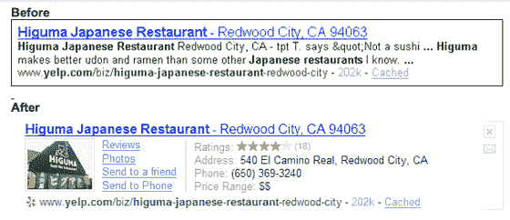
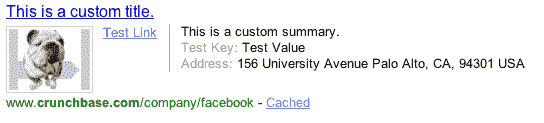

# 雅虎 SearchMonkey 启动私人测试版 TechCrunch

> 原文：<https://web.archive.org/web/https://techcrunch.com/2008/04/24/yahoo-open-search-platform-launches-into-private-beta/>

雅虎正在让有限数量的测试者进入它的 [SearchMonkey 开发者平台](https://web.archive.org/web/20230125000737/http://developer.yahoo.com/searchmonkey/preview.html)，一项服务[在二月份宣布](https://web.archive.org/web/20230125000737/http://techcrunch.com/2008/02/25/yahoo-announces-open-search-platform/)，允许网站所有者定制他们的雅虎搜索结果列表。

有了 SearchMonkey，网站所有者可以为雅虎搜索创建“应用程序”，用户可以安装这些应用程序，就像可以安装脸书应用程序一样。每个应用程序修改特定 URL 规范的结果(例如，Wikipedia 上的所有参考页面或 Amazon 上的产品页面)。修改既包括对搜索结果的基本元素(标题和描述)的更改，也包括图像、深层链接和键/值对之类的添加。

这是我们在关于 SearchMonkey 的第一篇文章中使用的 Yelp 搜索结果示例:

请注意，修改后的结果有评论和照片的链接，以及餐馆的评级、地址和电话号码等快速数据。这些额外的信息应该使搜索结果对搜索者更有用，并有希望吸引他们以更高的比率点击。

**创建应用**

我有机会使用 SearchMonkey 应用程序创建工具，它实际上非常简单(如果您熟悉 PHP、XSLT 和 DataRSS)。

虽然你可以将其他人的应用程序导入 SearchMonkey 并对其进行修改，但在为你的网站定制搜索结果时，你可能希望从头开始。这个过程从为你的应用程序选择名称、描述、类别、图标和类型开始。

有两种可能的类型:增强结果和信息栏。大多数网站所有者会选择“增强结果”选项，它可以像上面的 Yelp 例子一样显示大量信息。“信息栏”选项将补充信息压缩到每个搜索结果下方的交互栏中。用户需要使用它来显示更多的信息，但显然它在 HTML 和样式方面提供了更多的灵活性(我在测试中无法让它工作)。

一旦您设置了这些基本设置，您需要指出您的应用程序将针对的 URL 结构。该结构看起来类似于** . crunchbase . com/company/**，其中星号允许在 URL 模式的开头和/或结尾使用通配符匹配。该示例模式将用于定制 CrunchBase 上所有公司页面的搜索结果。

在提交了十个测试新应用程序的 URL 之后，事情开始变得有点复杂了。您必须选择要在搜索结果中显示的数据源，然后您需要告诉 SearchMonkey 如何显示这些数据。默认情况下，你可以访问雅虎的 16 个基本数据字段。这些包括结果的标题和描述，以及其他不太有用的东西，如语言、文件大小和在所有结果中的位置。

但是您希望从作为搜索结果列出的页面中提取信息，这样用户就可以通过点击了解到一些信息。所以你必须以某种方式通知雅虎这个信息。这需要创建一个“定制数据服务”，这是一个多步骤的过程，我将在下面描述。

首先，假设您已经创建了一个自定义数据服务。剩下的就是告诉 SearchMonkey 如何显示定制数据，这包括在一个简单的 PHP 类中设置值。您最多可以设置 4 个深层链接(仅限于您自己的域)和 4 个键/值对。当你试验结果的外观时，你可以通过点击“保存和刷新”在页面底部预览它。这给你持续的保证，你确实在做正确的事情(总是一件好事)。

**创建自定义数据服务**

这些是创建应用程序的基本步骤。然而，在此之前，您可能需要设置一个自定义数据服务。这些服务使用语义页面抓取或 web 服务来获取您定制结果所需的数据。

这种页面抓取方法遵循了[雅虎之前的声明](https://web.archive.org/web/20230125000737/http://techcrunch.com/2008/03/13/yahoo-embraces-the-semantic-web-expect-the-web-to-organize-itself-in-a-hurry/)它将采用语义网标准。它允许你从你的网页中提取信息，而不需要创建任何 API，因为它可以被教会抓取你的 HTML 结构中它需要的数据。

设置页面提取需要创建一个 XSLT 文件，这个过程通过使用 [XPather Firefox 扩展](https://web.archive.org/web/20230125000737/https://addons.mozilla.org/en-US/firefox/addon/1192)变得更加容易，它可以帮助您提取必要的代码来识别您站点上的数据。我不会深入讨论 XSLT 的任何细节，但是不用说，您将需要温习它的知识。您很可能还需要调整您的网站代码，以确保显示相同类型数据的页面之间的一致性。

至于创建定制数据服务的 web 服务方法，您需要了解 OpenSearch 格式的 XML 或 XSLT。

**我们的(半生不熟的)搜索结果定制**

那么我们的测试应用程序产生了什么呢？您看到的修改如下:

显然，它无论如何都不完整，但你可以看到结果有多少是可定制的——我们能够在没有太多配置的情况下从 CrunchBase 页面中提取脸书的地址。

**在搜索的进化中前进了一步**

虽然非技术读者的目光可能已经在这一点上呆滞了，但我甚至可以向他们保证，用 SearchMonkey 定制搜索结果并不是火箭科学。因此，我可以看到这在大大小小的网站所有者中变得非常流行。

那么，可能剩下的唯一问题就是雅虎将如何向其搜索用户推广这些应用。脸书在推出其平台时受益于强大的病毒式渠道，但我们尚未看到雅虎将如何吸引用户使用其应用程序。一些应用程序(对于更大、更突出的网站)可能会默认启用，但大多数可能需要人们手动选择。

假设一个充满活力的应用生态系统真的出现了，SearchMonkey 应该是朝着许多人所期待的更加个性化和潜在社会化的搜索迈出的重要一步。一旦你允许第三方开发者创新——以及用户采纳最好的创新——市场将直接有能力推动搜索向前发展。