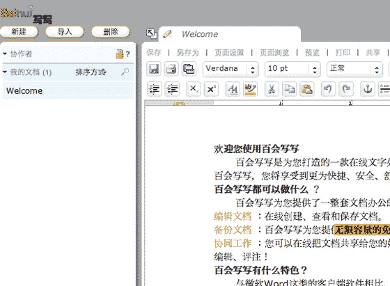

# Zoho 与百会 TechCrunch 在中国发布

> 原文：<https://web.archive.org/web/https://techcrunch.com/2008/04/24/zoho-launches-in-china-with-baihui/>

这是 Zoho 的一个明显的举动，他们创造了一套[在线办公应用](https://web.archive.org/web/20221209125328/http://www.crunchbase.com/company/zoho):他们产品的中国版本。据微软称，中国的 Office 盗版率为 90%以上，这个市场将更愿意使用在线版本的 Word、Excel、Powerpoint 等。超过美国和欧洲市场。

这些应用程序是通过与 Zoho 网站的宿主百会的合作交付的。目前，他们正在推出 [Writer](https://web.archive.org/web/20221209125328/http://xiexie.baihui.com/) 、 [Sheet](https://web.archive.org/web/20221209125328/http://gege.baihui.com/) 、 [Show](https://web.archive.org/web/20221209125328/http://xiuxiu.baihui.com/) 和 [CRM](https://web.archive.org/web/20221209125328/http://crm.baihui.com/) ，更多应用即将推出。

由于该软件由百会独立运行，用户将无法与正常的 Zoho 用户共享文档。然而，Zoho 本身支持 11 种不同的语言(英语、日语、中文、荷兰语、丹麦语、俄语、法语、德语、意大利语、西班牙语和瑞典语)，因此他们也直接与这个新的发行合作伙伴竞争。

目前中国唯一推出的非免费应用是 CRM。价格为 99 人民币/用户/月，约合 14 美元。这实际上比 Zoho 在美国收取的 12 美元/用户/月还要贵。

Zoho 表示，如今他们 50%的用户已经在美国以外的地方使用了，但是由于防火墙的原因，他们的网站在中国的速度非常慢。这种伙伴关系让他们走到了另一边。