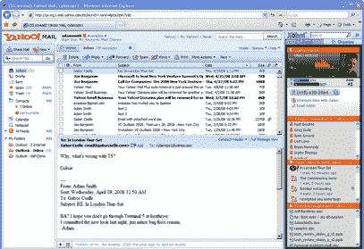
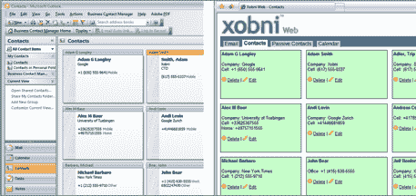

# Xobni 的秘密项目:将 Outlook 与雅虎邮箱 TechCrunch 合并

> 原文：<https://web.archive.org/web/https://techcrunch.com/2008/04/28/xobnis-secret-project-merge-outlook-with-yahoo-mail/>

# Xobni 的秘密项目:将 Outlook 与雅虎邮箱合并

 电子邮件初创公司 [Xobni](https://web.archive.org/web/20230216125839/http://www.xobni.com/) 可能会也可能不会与微软进行[收购谈判](https://web.archive.org/web/20230216125839/https://techcrunch.com/2008/04/20/microsoft-signs-letter-of-intent-to-acquire-xobni/)(他们说不会)，但他们确实有一个微软会感兴趣的绝妙项目，尤其是如果其提议的雅虎交易获得通过的话。Xobni 制作了一个插件，通过以更容易找到的方式组织对话和人员，给微软的 Outlook 电子邮件软件充能。它还根据用户发邮件最多的人向用户展示他们的社交网络。

现在，该公司已经有了一个工作原型，可以使用全球第二大电子邮件:雅虎邮箱。雅虎邮件产品还没有发布，甚至还没有进入测试阶段。这只是一个在 Internet Explorer 上的工作演示。(下面第一张截图)。每次你点击雅虎邮箱里的一封邮件，右边的侧边栏会显示一个图表，显示你当天收到的邮件总数，你过去收到或发送给那个人的邮件数量，以及你与那个人之前通过邮件交流的对话和文件的链接。它还显示了任何其他可能与此人有关的联系人，因为他们在之前的电子邮件中被选中。

但 Xobni 不仅可以在雅虎邮箱中工作，还可以与 Outlook 集成。因此，在“conversations”下的 Xobni 窗格中，您还可以在 Outlook 中看到您与该联系人之前的任何电子邮件(假设您安装了用于 Outlook 的 Xobni 插件)。类似地，与该联系人在雅虎上的对话也可以在 Outlook 的 Xobni 侧边栏中看到(下面的第二个屏幕截图)。Xobni 不断同步雅虎邮件和 Outlook 联系人，你可以在网络上的一个视图中看到它们(下面的第三个屏幕截图)。而且，这是很好的一部分，你可以使用 Xobni 搜索框搜索雅虎和 Outlook 的电子邮件，甚至可以在浏览器中搜索。

没有消息说这可能会在什么时候发布，但是 Xobni 超越 Outlook 是有意义的。事实上，它首先关注雅虎也并不奇怪，因为新任首席执行官杰夫·邦福特曾经在布拉德·加林豪斯手下领导雅虎的即时通讯团队。而且，如果微软的任何人路过 Xobni 办公室，那么，这就是那种达成交易的演示。毫无疑问，Outlook 和雅虎邮件的整合在任何合并后的清单上都排在前列。看起来 Xobni 已经领先一步了。

Xobni 还在私下测试中。如果你想尝试一下(仅限 Outlook)，第一批到[注册的 200 人(代码为“techcrunch200”)将进入这里。](https://web.archive.org/web/20230216125839/http://www.xobni.com/priority)

