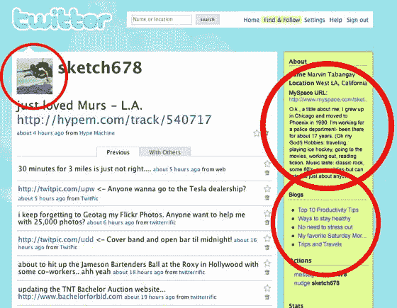

# MySpace 拥抱数据可移植性，与雅虎、Ebay 和 Twitter 合作

> 原文：<https://web.archive.org/web/https://techcrunch.com/2008/05/08/myspace-embraces-data-portability-partners-with-yahoo-ebay-and-twitter/>

[MySpace](https://web.archive.org/web/20230226020255/http://www.myspace.com/) 今天宣布广泛支持[数据可移植性](https://web.archive.org/web/20230226020255/http://dataportability.tumblr.com/post/34138755)标准，以及与雅虎、Ebay、Twitter 和他们自己的 Photobucket 子公司的数据共享合作关系。这个新项目被称为 MySpace 的“数据可用性”, MySpace 表示，这是他们致力于与互联网其他部分友好相处的一个例子。

上面显示了 Twitter 数据共享的实际效果。MySpace 本质上是通过合作伙伴(以前是内部的)RESTful API 向他们提供关键的用户数据，包括(1)公开的基本个人资料信息，(2) MySpace 照片，(3) MySpaceTV 视频，以及(4)朋友网络，以及通过 [OAuth](https://web.archive.org/web/20230226020255/http://oauth.net/) 进行的用户认证。

主要目标是允许用户在 MySpace 这样的网站上维护关键的个人数据，而不是将其锁在孤岛上。以前，用户可以将这些数据转化为小工具，并添加到第三方网站。但 MySpace 表示，这并不能弥合独立自主网站之间的差距。每个地点仍然是一个孤岛。

但是有了数据可用性，合作伙伴将能够访问 MySpace 的用户数据，将其与他们自己的数据相结合，并在正常的 widget 框架之外将其呈现在他们的网站上。例如，好友列表可以同步。或者 Twitter 可能会使用这些数据来推荐你的 MySpace 好友。

数据共享是动态的，这意味着它会不断更新。这也意味着用户许可不是一次性的事情。用户可以随时更改或撤销第三方访问数据的权利。MySpace 表示，这些第三方“受到严格的服务条款约束”，一旦许可被撤销，这些第三方就不得存储或使用这些数据。

目前，只有四家发布合作伙伴可以访问数据可用性，这些功能将在未来几周内上线。随着时间的推移，会有更多的合作伙伴加入进来，MySpace 表示，他们最终会让“夫妻”网站也参与进来。

**开放社交呢？**

MySpace [是谷歌 OpenSocial 项目的合作伙伴](https://web.archive.org/web/20230226020255/https://techcrunch.com/2007/11/01/confirmed-myspace-to-join-google-opensocial/)，但这是在该框架之外完成的。MySpace 表示，一旦开发并公布，他们将采用围绕数据共享发展的开放社交 API。

**所有用户数据的中心**

历史上，MySpace 在创新方面落后于脸书。但他们这次绝对“明白”了。如此公开地共享用户数据(在用户许可的情况下)是激励用户首先在 MySpace 上存储他们所有核心数据的极好方式。用户最终需要互联网上的一个地方来存储他们的数据，或者许多地方来存储不同类型的数据。但他们不想要的是，在当今世界，他们在过多的社交网络上重新创建和存储相同的数据，只是因为所有这些网站拒绝共享。我们开始看到闸门打开，数据共享的想法成为现实(这在很大程度上要归功于 [DataPortability](https://web.archive.org/web/20230226020255/http://www.dataportability.org/) 和该领域其他积极分子的努力)。

通过先发制人，MySpace 取得了领先，并有机会成为长期的赢家——这意味着许多人使用 MySpace 作为存储数据的地方，并从那里将数据分享给其他应用程序。期待谷歌的下一步行动。

参见我在“[集中的我](https://web.archive.org/web/20230226020255/https://techcrunch.com/2008/03/30/friendfeed-the-centralized-me-and-data-portability/)上的帖子，了解我对此的更多想法。