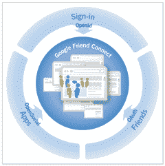

# 谷歌确认好友联系 TechCrunch

> 原文：<https://web.archive.org/web/https://techcrunch.com/2008/05/12/google-confirms-friend-connect/>

正如我们[周五](https://web.archive.org/web/20221209194043/http://www.beta.techcrunch.com/2008/05/09/threes-company-google-to-launch-friend-connect-on-monday/)报道的那样，谷歌将推出自己的数据便携性产品，名为 Friend Connect。今晚晚些时候将会公布更多关于预告片的细节，但是今天早上在的一份[新闻稿中证实:](https://web.archive.org/web/20221209194043/http://www.google.com/intl/en/press/annc/20080512_friend_connect.html)

> *不是社交网络的网站可能仍然希望成为社交网站——现在他们可以轻松做到。有了 Google Friend Connect(参见[http://www.google.com/friendconnect](https://web.archive.org/web/20221209194043/http://www.google.com/friendconnect)今晚的篝火晚会之后)，任何网站所有者都可以在他或她的网站上添加一段代码，无需编程就可以立即启动并运行社交功能——从内置功能中挑选，如用户注册、邀请、成员库、消息发布和评论，以及由 OpenSocial 开发者社区构建的第三方应用程序。*
> 
> 使用 Google Friend Connect 的任何网站的访问者都可以看到、邀请新朋友并与之互动，或者使用安全授权 API 与网络社交网站上的现有朋友互动，包括脸书、Google Talk、hi5、orkut、Plaxo 等等。

Friend Connect 将支持现有的标准，如 OpenID、OAuth、OpenSocial，以及来自脸书、谷歌和 MySpace 的数据访问 API。此前，MySpace 和脸书也发布了类似的公告。正如迈克尔周五指出的:

> *这些公司急于推出产品的原因是，无论谁是这个领域的参与者，从长远来看，都有可能控制用户数据。如果用户不必将个人资料和朋友信息放入多个网站，他们会倾向于他们认同的一个网站，然后允许其他网站访问这些数据。*

更新:我得以与谷歌工程总监大卫·格雷泽交谈以获得更多细节。他说，朋友连接的目的是“给用户一条捷径，让他们可以在其他地方建立联系。”因此，如果你去的网站是 Friend Connect 的一部分，你就可以用你的脸书、Google Talk、hi5、Orkut 或 Plaxo IDs 登录(你可以选择你想用哪个登录，还会有更多的选项)。然后，您授权该网站从该网络中检索您朋友的列表。那些碰巧是你所在网站的成员的朋友中的任何一个都会出现，你可以和他们互动。

Friend Connect 面向那些甚至没有任何用户信息的小网站的长尾。它允许他们接入更大的网站，并利用他们的用户登录和注册、朋友列表以及这些朋友之间的互动。它利用了许多现有的标准，包括脸书的标准(它不是官方合作伙伴，但谷歌正在利用其发布的 API)。在出现的许多标准中，格雷泽认为 [OAuth](https://web.archive.org/web/20221209194043/http://oauth.net/) 是正确的做法。

格雷泽承认，Friend Connect 只是向更大的目标迈出的一小步，这个目标就是能够在任何应用程序、任何网站上与任何朋友联系。但是现在还没有。例如，它与谷歌的[社交图 API](https://web.archive.org/web/20221209194043/http://www.beta.techcrunch.com/2008/02/01/googles-gathers-social-graph-information-from-the-web-launches-api/) 不兼容，更多的社交和身份网络仍然需要连接。

Friend Connect 更大的缺点是，使用它的网站无法将数据与自己的数据混合起来，从而开发出引人注目的新应用。格雷泽证实，数据将通过 iframe 发送到第三方网站，而不是直接通过一套 API(正如迈克尔周五推测的那样)。然而，格雷泽也表示，如果最终谷歌或其他人让网站将朋友连接数据与自己的数据结合起来成为可能，他不会感到惊讶。

基本上，Friend Connect 所做的就是从大型社交网络中以任何方式收集这些数据，然后以统一的方式呈现给第三方网站。它也是这些第三方网站和大型社交数据仓库之间的通道。这消除了想要进入这些社交网络的小网站的任何编程麻烦，但它也将谷歌定位为连接所有这些不同身份系统的中央开关。