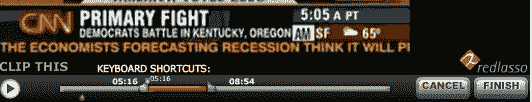

# 博主欢欣鼓舞！使用 RedLasso 定制电视剪辑(更新)TechCrunch

> 原文：<https://web.archive.org/web/https://techcrunch.com/2008/05/20/bloggers-rejoice-customized-tv-clips-with-redlasso/>

允许博主在帖子中嵌入电影的视频网站并不少见。但到目前为止，博客作者通常不得不依赖他人来捕捉、编辑和上传这些内容——还没有一种简单的方法来从最近播放的媒体中创建自己的剪辑。

红色拉索正在寻求改变这种状况。该网站目前处于私人测试阶段，它创建了一个有用的(也可能有问题的)系统，允许博客作者筛选最近的电视广播，并提取他们自己的剪辑。

该网站在播出后一小时内从知名媒体网站(CNN、喜剧中心和 BBC)获取内容。然后，RedLasso 使用隐藏字幕转录和语音音频检测为每个文件创建一个索引(该公司表示，使用语音而不是基于字典的检测对正确的名称和地点更有效)。

该索引可搜索完整呈现的相关广播。在找到想要的部分后，用户可以设置端点，剪辑被生成并准备好被嵌入。

这个系统听起来很有用，但似乎也容易被滥用。因为节目是完整拍摄的，RedLasso 可以很容易地用作虚拟(免费)Tivo。为了应对这种情况，RedLasso 采取了一种积极主动的方法:他们筛选每一个 beta 版的申请人，以确保他们确实是博客作者。他们也在监控视频的使用，所以如果他们注意到有人看了太多的日常节目，他们会终止他们的账户。这在封闭测试中可能足够好，但一旦服务上市，公司可能无法处理滥用的增加。

然后就是版权问题。雷德拉索说，他们已经与一些网络进行了谈判，但他们尚未建立任何内容交易。这将是网站的决定性因素。该公司的首席运营官艾尔·麦高恩说，他们制作的短片属于合理使用，但我们已经无数次看到这一论点失败。那么在 RedLasso 服务器上托管的完整节目呢？如果网站希望长期成功，就需要在法律手段关闭它们之前建立许可协议。

RedLasso 去年 11 月举行了 650 万美元的首轮融资[轮](https://web.archive.org/web/20230219180846/http://www.crunchbase.com/company/redlasso)，他们正在寻求 1000 万至 1500 万美元的 B 轮融资。这一领域的另一个玩家是 [Blinkx.tv](https://web.archive.org/web/20230219180846/http://www.blinkx.tv/) (具有音频检测功能)，尽管用户不能定义自己的剪辑。

**更新:**和……停止&的终止函[已经到达](https://web.archive.org/web/20230219180846/http://www.alleyinsider.com/2008/5/party_s_over_bloggers_cbs_nbc_fox_sue_redlasso)。在我们今天的采访中，该公司没有提到他们新的法律问题，甚至没有直接回答这个问题。当几分钟前再次被问及此事时，麦高恩说“我们不知道这封信已经泄露了。”

[red lasso id = ' 9f 5 bee 86-fc7d-4039-b3f 7-1bf 09 f 282559 ']