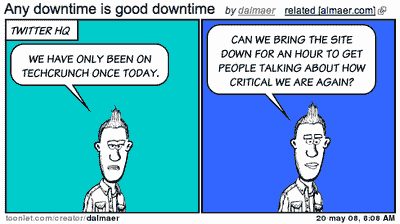

# Twitter:技术上有些问题 TechCrunch

> 原文：<https://web.archive.org/web/https://techcrunch.com/2008/05/20/twitter-something-is-technically-wrong/>

# 推特:技术上有些问题

他们的话，不是我的。

当 [Twitter](https://web.archive.org/web/20230218102536/http://www.twitter.com/) 像现在和昨天一样关闭时，我几乎不再费心去发帖子了(老实说，当他们保持网站 24 小时在线时，这就是新闻)。但是，说真的，他们需要齐心协力。已经不尴尬了。

传言说他们已经结束了他们的大[轮融资](https://web.archive.org/web/20230218102536/https://techcrunch.com/2008/04/28/how-much-is-twitter-worth/)，事情都在那里击掌庆祝，但更多的是，人们不会只是谈论为了[一些新的](https://web.archive.org/web/20230218102536/https://techcrunch.com/2008/05/05/twitter-can-be-liberated-heres-how/)而放弃服务，他们真的会去做(是的，[甚至是我](https://web.archive.org/web/20230218102536/https://techcrunch.com/2008/04/22/twitter-may-not-have-to-care-about-uptime-any-longer/))。

或者对你的用户有足够的尊重，让我们知道发生了什么。

无论如何，我的心情特别糟糕，因为我食物中毒了(非常感谢西雅图君悦酒店)，在推特上说这将使我感觉稍微好一点，因为一群人会在回复中说些好话。但他们连这也夺走了。

**更新:**

哇，[有人在听](https://web.archive.org/web/20230218102536/http://blog.twitter.com/2008/05/not-true.html)。实际交流是如此受欢迎:*“今天下午早些时候，我们在一次例行更新中导致一个数据库出现故障。我们转而使用副本，希望恢复能够快速进行。”如果 Twitter 只是将他们的博客转移到另一个平台上，以便在用户最需要的时候不会失败，那就太好了。*