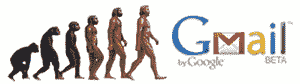
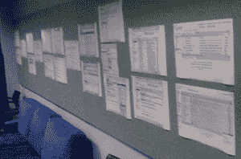

# 截图中发布前 Gmail 的演变 TechCrunch

> 原文：<https://web.archive.org/web/https://techcrunch.com/2008/06/06/the-evolution-of-pre-launch-gmail-in-screenshots/>

# 截图中的预发布 Gmail 的演变

昨天参观谷歌 Gmail 实验室的[发布会](https://web.archive.org/web/20230214101954/https://techcrunch.com/2008/06/05/gmail-labs-a-public-stage-for-googlers-20-time/)时，产品经理 [Keith Coleman](https://web.archive.org/web/20230214101954/http://www.crunchbase.com/person/keith-coleman/) 带我们参观了谷歌总部的 47 号楼。

一路走来，我们看到谷歌人在 Gmail、Reader、Calendar 和其他相关项目上努力工作。但最酷的部分是在一个会议室的停留，科尔曼展示了描绘 Gmail 用户界面演变的打印截图，这是在 2004 年 4 月 1 日向公众发布之前。

虽然截图没有标明具体日期，但它们是按照 Gmail 发展的大致顺序从左到右排列的。在第一张截图中，可以追溯到 2002 年 3 月，我们看到 Gmail 是一个简单的 [Paul Buchheit](https://web.archive.org/web/20230214101954/http://www.crunchbase.com/person/paul-buchheit) 黑客通过关键词搜索他的邮件。

然后，网络应用程序会经历一系列的转换、标识和命名。该产品的时髦标志包括鱼、小指和大脑卡通老鼠。最终成为 Gmail 的产品的 Alpha 和内部名称包括“谷歌电子邮件”和几个我们不应该提及的非谷歌名称。在某个时候，谷歌开始用代号 Caribou 来称呼这个项目。

将消息合并到对话中的想法在一开始就实现了，因为开发人员发现他们自己的大多数通信都很适合这种格式。

Digg _ URL = " https://TechCrunch . com/2008/06/06/the-evolution-of-pre-launch-Gmail-in-screens/"；

有一段时间，Google Groups 是和 Gmail 一起开发的，在某一点上，Gmail 转向了一个新的设计方向，而 Groups 则保留了 Gmail 当时的设计。如今，这种共同的祖先仍然可以在群组中看到，这些群组拥有曾经与 Gmail 共享的相同的左侧导航(群组显示群组名称，Gmail 用于显示邮件主题)。

下面是这些截图的雏形——尽管名字、消息正文和其他敏感信息都被模糊了。