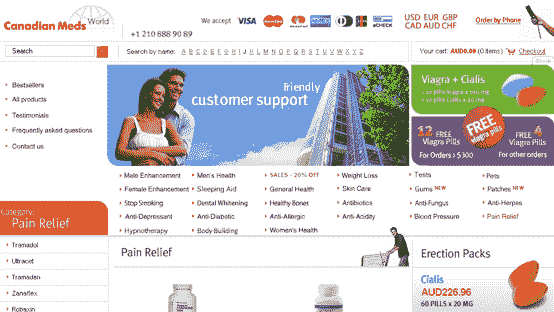

# Wordpress 安全问题导致大规模黑客攻击。你的博客是下一个吗？TechCrunch

> 原文：<https://web.archive.org/web/https://techcrunch.com/2008/06/11/my-blog-was-hacked-is-yours-next-huge-wordpress-security-issues/>

由于其作为博客平台的受欢迎程度， [WordPress](https://web.archive.org/web/20221005200410/http://wordpress.org/) 已经成为黑客的主要目标，这些黑客试图接管博客以实现他们控制的其他网站的搜索引擎优化(SEO)、流量重定向和其他目的。最近有大量的自动攻击利用了最近在 WordPress 中发现的安全漏洞。

迄今为止，WordPress 一直在通过在发现新漏洞的几天内发布更新来跟上安全漏洞，但在过去的几天里，似乎没有人知道新漏洞的答案。

一月份的时候，这样的攻击确实发生在我身上，当时我注意到我主持的一个[博客](https://web.archive.org/web/20221005200410/http://www.nik.com.au/)上散落着数万页关于药品和成人材料的内容。有人访问了这个博客并创建了新的页面，比如这个:

这个博客当时运行的是 WordPress 的最新版本，我追踪到了一个简单的缺陷，它没有充分过滤用户输入。值得称赞的是，WordPress [发布了](https://web.archive.org/web/20221005200410/http://wordpress.org/development/2007/01/wordpress-207/)新版本，修补了漏洞(以及其他漏洞),并要求用户升级。

那是六个月前的事了，但是在五月份又发生了一次，这次是一个新的安全漏洞，并且在 WordPress 能够更新之前几天又发生了一次。问题是，大多数博客所有者并没有意识到黑客针对博客造成的威胁，因为一次成功的攻击可能不会以任何方式泄露博客所有者。WordPress 中的安全漏洞已经导致了大量博客的自动攻击，通常网站所有者并没有意识到发生了什么。

如果你目前没有运行 WordPress 的 **最新[版本](https://web.archive.org/web/20221005200410/http://wordpress.org/download/)，那么你的网站很有可能已经被入侵。**

成功攻击的常见结果是安装了后门程序(意味着黑客可以在以后返回并进入您的博客)、下载所有用户的密码或生成垃圾页面。此时，你不再完全控制你的博客，包括所有的内容和 WordPress 安装程序可以访问的同一个数据库中的任何东西。

黑客正在利用该软件的开源特性来分析源代码，并测试其潜在的漏洞。然后，开发人员和用户就可以检测、跟踪并关闭攻击者正在使用的代码中的漏洞。这种模式似乎是，当一个新的漏洞被发现时，它被广泛地利用，然后开发人员匆忙推出一个补丁和一个新的版本。令人欣慰的是，大多数由自动化攻击造成的损害可以通过升级来逆转，尽管在某些情况下，您可能会留下数千个页面和图像需要清理(它们通常隐藏得很好)。

对于 WordPress 的用户来说，备份是必不可少的，就像频繁更新一样，监控你的博客使用情况，跟踪官方博客和其他博客，看是否有新的安全漏洞。还有大量[指南](https://web.archive.org/web/20221005200410/http://s.technorati.com/wordpress+security+tips)[和](https://web.archive.org/web/20221005200410/http://1cat.biz/wordpress-security-tips/)[应用](https://web.archive.org/web/20221005200410/http://downloads.wordpress.org/plugin/wp-security-scan.2.2.64.zip)可以帮助网站所有者进一步保护他们的博客。

目前还不知道有多少 WordPress 博客被感染(我见过双重感染的例子，之前被入侵的主机再次被入侵)，但作为一个指标，在 TechCrunch 和我访问的十多个 WordPress 博客中，我们可以看到每天有超过 100 个针对这些不同安全漏洞的请求。[关于](https://web.archive.org/web/20221005200410/http://selfmademinds.com/200805/webmasters-nightmare-1-wordpress-blog-hacked/)[被黑](https://web.archive.org/web/20221005200410/http://paulhaahr.com/blog/2008-06-01-hacked) [博客](https://web.archive.org/web/20221005200410/http://baseblogging.net/2008/06/07/wordpress-hacked/)的故事越来越多<a href = " http://blog search . Google . com/blog search？HL = en&q = WordPress hacked&ie = UTF-8&scoring = d“常见且持续的担忧是最新的安全漏洞随时可能被发现和利用。

**更新**:在评论中，来自 Six Apart 的 Anil Dash 已经[链接到他们博客上的一篇关于 MovableType 与 WordPress 在安全性方面的文章](https://web.archive.org/web/20221005200410/http://www.movabletype.com/blog/2008/06/movable-type-a-history-of-secu.html)。