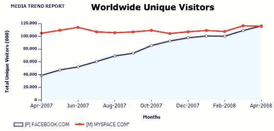
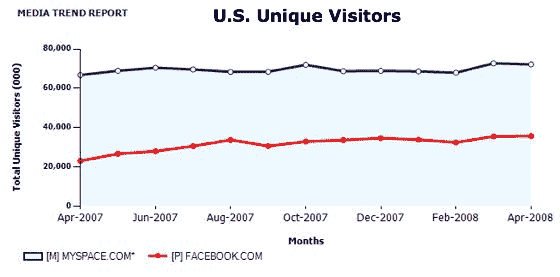

# 脸书不再是第二大社交网络

> 原文：<https://web.archive.org/web/https://techcrunch.com/2008/06/12/facebook-no-longer-the-second-largest-social-network/>

# 脸书不再是第二大社交网络

鉴于脸书在过去几年里的巨大增长，这是不可避免的，但 2008 年 4 月是一个里程碑:根据康姆斯克发布的数据，在全球每月独立访客方面，[脸书](https://web.archive.org/web/20230326023521/http://www.crunchbase.com/company/facebook)正式赶上了 [MySpace](https://web.archive.org/web/20230326023521/http://www.crunchbase.com/company/myspace) 。这两项服务每月都吸引大约 1.15 亿人访问各自的网站。

然而，脸书的大部分用户增长是在国际市场——MySpace 仍然在美国市场上统治着脸书，每月有 7200 万用户。脸书每月有 3600 万个 uniques，高于一年前的 2300 万个。

在过去的 12 个月中，脸书每月增加 7500 万个 unique，但其中只有 1300 万个访问者位于美国。MySpace 在此期间增加了 500 万个美国 unique-按照这个速度，脸书需要 4 年多的时间才能在美国市场赶上 MySpace。

从广告的角度来看，这些国际用户到底有多少价值，这确实是个问题。我们将在下周发表我们对此的想法。