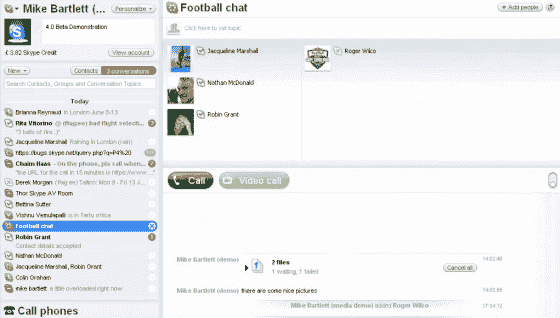
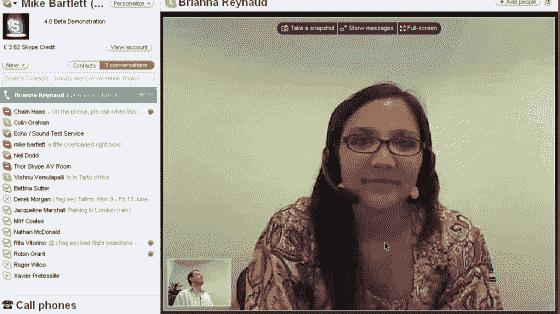
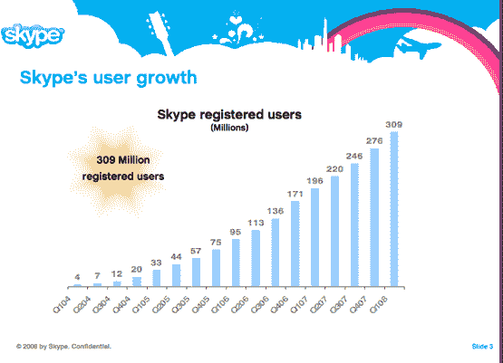
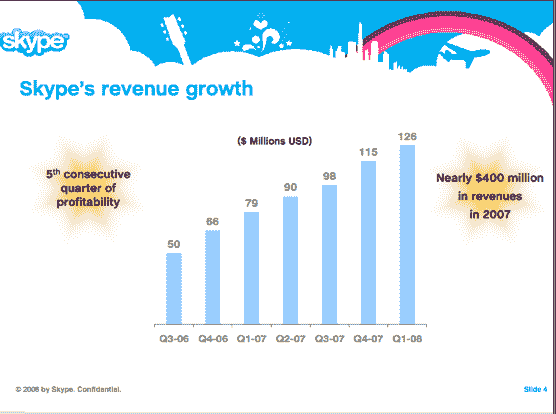

# Skype 4.0 测试版:全是关于视频 TechCrunch

> 原文：<https://web.archive.org/web/https://techcrunch.com/2008/06/17/skype-40-beta-its-all-about-video/>

Skype 正在进行一次重要的、急需的升级:Skype 4.0。总裁乔希·西尔弗曼称之为“Skype 历史上最大的新版本”新的软件客户端将于明天在测试版发布(仅适用于 Windows)，占据整个屏幕。视频在前面和中间。

“我们以前的用户界面是专门为语音设计的，”Silverman 告诉我。(我在 [TalkCrunch](https://web.archive.org/web/20230217061308/http://www.talkcrunch.com/) 上放了[一段我对他采访的节选](https://web.archive.org/web/20230217061308/http://www.talkcrunch.com/2008/06/17/skype-40-interview-with-president-josh-silverman/)，或者你可以直接听[音频文件](https://web.archive.org/web/20230217061308/https://techcrunch.com/wp-content/uploads/2008/06/skype_interview.mp3)。现在，通过全屏，功能可以分散开来，变得更加简单。这也使它成为一个更好的视频聊天客户端。现在有一个绿色的“视频通话”按钮。有画中画功能，你可以移动缩略图来显示你的视频。

点对点技术确保了高质量的视频，并且在通话过程中有更多的空间用于文本聊天或发送文件。当你进行视频聊天时，它真的有置身于视频聊天室的感觉。你也可以从 Metacafe 和 DailyMotion(而不是 YouTube)中获取视频。虽然 Skype 可以在同一个电话中同时处理多达 25 个参与者的语音通话，但目前仅限于一对一的视频聊天。不过，这些可以与多方语音和文本聊天相结合，其他人只听到音频。相比之下， [Paltalk 可以在类似房间的环境中同时进行数千次视频聊天。](https://web.archive.org/web/20230217061308/https://techcrunch.com/2008/06/10/paltalk-brings-its-massive-multiperson-video-chat-to-the-web/)

Skype 4.0 的另一个重大变化是，现在整个体验都集中在对话和管理这些对话上，无论是与团体还是个人的对话。Skype 4.0 允许您从 Outlook、Outlook Express、Hotmail 和 Yahoo Mail 导入联系人。(没有 Gmail，这是对谷歌的又一次冷落)。

还有其他改进，例如当你插入新的耳机或如果你的笔记本电脑缺少内置麦克风时，自动检测。它也有测试你的音频和视频质量的软件工具。总而言之，Skype 4.0 是一个进步。

易贝旗下的 Skype 拥有 3.09 亿注册用户，第一季度收入 1.26 亿美元。

 

