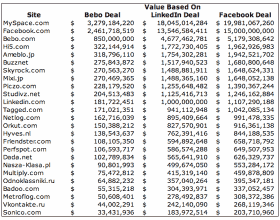

# 模拟社交网络的真实市场价值

> 原文：<https://web.archive.org/web/https://techcrunch.com/2008/06/23/modeling-the-real-market-value-of-social-networks/>

MySpace 值 30 亿美元，还是 200 亿美元？这取决于你如何评价一个用户。

现在是时候开始比较大型全球社交网络，而不是唯一访客和页面浏览量。我认为，对特定用户进行估值的一个有效方法是基于他们所在国家的人均互联网广告支出。花费越高，社交网络通过向用户提供广告和其他产品从用户那里获得的价值就越大。这意味着，就收入潜力而言，目前少数几个关键国家的用户比世界其他地区的用户更有价值。

我们已经开始建立一个模型，按国家/地区查看社交网络的使用情况，并将其与每个国家的互联网广告总支出的可用数据进行比较。然后，该模型能够将苹果与橙子的比较转化为苹果与苹果的比较。早期的结果令人惊讶。

任何资产的最终金融价值最终都是市场愿意为其支付的价格。我们只有几个数据点可以帮助我们:[脸书](https://web.archive.org/web/20230404135822/http://www.crunchbase.com/company/facebook)、 [Bebo](https://web.archive.org/web/20230404135822/http://www.crunchbase.com/company/bebo) 和 [LinkedIn](https://web.archive.org/web/20230404135822/http://www.crunchbase.com/company/linkedin) 的价值分别为[150 亿美元](https://web.archive.org/web/20230404135822/https://techcrunch.com/2007/10/25/perspective-facebook-is-now-5th-most-valuable-us-internet-company/)、[8.5 亿美元](https://web.archive.org/web/20230404135822/https://techcrunch.com/2008/03/13/aol-buys-bebo-for-750-million/)和[10 亿美元](https://web.archive.org/web/20230404135822/https://techcrunch.com/2008/06/17/linkedin-raises-53-million-at-billion-dollar-valuation/)(尽管实际上只有 Bebo 被完全出售；脸书和 LinkedIn 以这些估值筹集了投资。MySpace 最近一次估值只有 5 . 8 亿美元，那是在 2005 年，当时它被新闻集团收购。

哪个估值最「正确」？根据目前可用的数据很难说，这些数据大多只是来自康姆斯克和其他服务的总浏览量和独立访客数。例如，根据世界范围内的独立访问者来看，[脸书最近超过了 MySpace](https://web.archive.org/web/20230404135822/https://techcrunch.com/2008/06/12/facebook-no-longer-the-second-largest-social-network/) 成为“最大”的社交网络。

根据全球原始用户数量，最大的社交网络依次是脸书、Myspace、Hi5、Friendster、Orkut 和 Bebo。但是当你应用我们在下面创建的模型时，考虑到用户居住的地方，排名会有很大的变化。根据现有数据，MySpace 是迄今为止最有价值的社交网络。像 Orkut 这样的竞争对手，即使拥有接近 1/4 的用户数量，其价值也只有 MySpace 的 1/20。

**恰当地排列社交网络**

 **我们的模型采用可用国家和地区的康姆斯克数据。我们已经用我们能够收集到的数据绘制了 26 个知名社交网络的图表。然后，我们计算了这些国家每个网民的平均广告支出(由普华永道在最近的一份报告中估算)。例如，在美国，2008 年互联网广告支出总额估计为 252 亿美元。根据康姆斯克(1.91 亿)的数据，我们将这个数字除以美国的在线人数，得到人均互联网支出为 132 美元。[在此查看原始数据和计算](https://web.archive.org/web/20230404135822/http://spreadsheets.google.com/pub?key=pSnKg7M-DPfdEvcCrNoiETA)。

顺便说一下，美国在每个互联网用户最有价值的市场中排名第四，排在英国(213 美元)、澳大利亚(148 美元)和丹麦(144 美元)之后。

然后，我们将每个市场中每个用户的平均互联网支出乘以每个社交网络在该市场中的独立用户数量，本质上是根据追逐用户的广告费用创建一个“加权平均值”。如果一个社交网络在美国、日本、英国、德国、澳大利亚和其他更大的广告网络拥有更多用户，他们将拥有更高的加权平均估值。

我们认为这种模型是对各种竞争社交网络进行排名的有效方式。它摧毁了 Orkut 和 Friendster 等在广告支出很少的市场上拥有数千万用户的网络，并摧毁了在更高价值市场上拥有大量用户的网络。

基于这种模式，MySpace 是迄今为止最有价值的社交网络。第二名脸书的价值只有 MySpace 的 75%(尽管它现在有更多的用户)，接下来是 Bebo(占 MySpace 价值的 26%)，Hi5 和 Amebio。LinkedIn 排在第 11 位，占 MySpace 价值的 6%。
 **估价范围**

据报道，大型网络的真实收入数据支持这种估值方法，并显示出货币化努力与网络用户之间的直接联系。据估计，MySpace 去年创造了 7.55 亿美元的收入。(现在)规模更大的脸书，在利润较低的市场拥有更高比例的用户，今年[收入仅为 2.55 亿美元](https://web.archive.org/web/20230404135822/http://www.nytimes.com/2008/06/16/business/media/16myspace.html?pagewanted=print):

> EMarketer 估计，MySpace 在截至 6 月 30 日的财年将实现 7.55 亿美元的收入。MySpace 对这一估计不予置评。预计约三分之一的收入将来自谷歌广告协议。据估计，脸书今年的广告收入为 2.65 亿美元。

由于我们有三个评估社交网络的最新数据点(脸书为 150 亿美元，Bebo 为 8.5 亿美元，LinkedIn 为 10 亿美元)，我们可以开始根据模型应用估值范围。脸书的 1020 万价值点和 150 亿美元的估值使每个价值点的价值达到 1467 美元。LinkedIn 的估值非常相似，每价值点 1325 美元。在富裕的英国市场拥有大量用户的 Bebo 似乎被低估了，每价值点仅 241 美元。

基于这三个公开的数据点，我们为全球前 25 大社交网络创建了价值范围。差距非常大(例如，MySpace 的价值在 33 亿美元到 200 亿美元之间，这是根据可比数据得出的)。但是它确实产生了非常有趣的数据。例如，如果脸书和 LinkedIn 的估值与 Bebo 类似，它们的价值将分别仅为 25 亿美元和 1.82 亿美元，远低于它们的投资者最近购买它们的价格。

有趣的是，最近[以 9200 万美元出售波兰社交网络 Nasza-klasa](https://web.archive.org/web/20230404135822/https://techcrunch.com/2008/06/11/estonias-forticom-acquires-controlling-stake-in-polish-portal-for-92-million/) ，似乎与 Bebo 的价格同步。根据 Bebo 的估值指标，该模型估计其价值为 9100 万美元。

目前的模型和分析存在一些重大缺陷。首先，LinkedIn 可能属于一个不同的网络类别，因为它的所有用户都专注于业务(那里没有超级戳)。因此，无论在哪个地理市场，谷歌都可能比竞争对手更好地利用用户赚钱。尽管如此，我们还是决定把它作为一个数据点，但有一点要注意。

模型本身需要更多的数据。用户数量基于四月康姆斯克。虽然绝对排名可能不会改变，但我们很快会根据 5 月份的数据进行修正。更重要的是，一些大市场还没有包括在内。例如，中国互联网广告市场在 2008 年估计有 20 亿美元，然而他们并没有被包括在内(主要是因为我找不到网络用户数量的数据)。此外，由于数据可用性问题，菲律宾没有单独列出(尽管菲律宾今年的互联网广告市场总额只有 300 万美元，所以不会对排名产生实质性影响，尽管 Friendster 在那里非常强大)。最后，俄罗斯目前与“欧洲其他国家”归为一组，需要单独划分出来——它拥有庞大且不断增长的在线广告市场和大量用户，因此这一更新可能会影响中级网络排名。

广告支出模型只是一个估计，而且来源单一。我不太关心这些数据，因为如果估计绝对正确，这对于模型来说并不重要。然而，如果不同国家的不同比率的估计是错误的，那么模型将会崩溃。如果我们发现国家之间更好的相对数据，我们将使用这些数据更新模型。但目前来看，普华永道的数据似乎相当不错。

最后，这个模型没有考虑公司层面的执行力。两个非常相似的网络基于广告方式，甚至雇员的野蛮努力和激情，可能会有很大的不同。这个模型显然没有考虑到这一点。

我还注意到陈楚翔上周的分析，该分析采用了类似的方法，使用了谷歌趋势数据，而不是康姆斯克。然而，谷歌的数据不够细致，不足以真正挖掘相对价值，而且他缺乏关于平均互联网支出的最新和深入的数据。尽管如此，我还是同意他的方法论。

正如我在这篇文章的[结尾所写的，在比较社交网络时，你必须考虑用户当前的货币化价值。没有它，原始用户数毫无意义。](https://web.archive.org/web/20230404135822/https://techcrunch.com/2008/06/12/facebook-no-longer-the-second-largest-social-network/)**