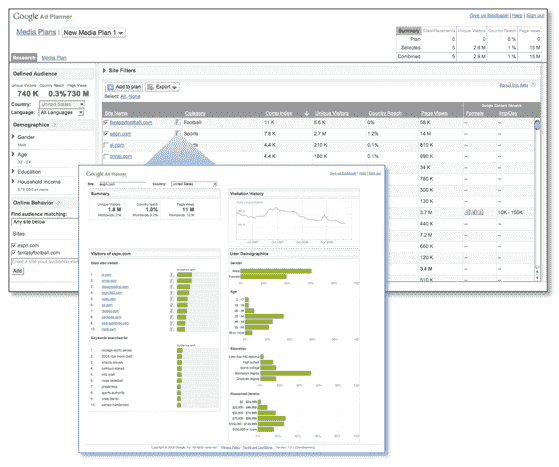

# Google Ad Planner 是从 Google 工具栏获取数据的吗？TechCrunch

> 原文：<https://web.archive.org/web/https://techcrunch.com/2008/06/24/is-google-ad-planner-getting-its-data-from-the-google-toolbar/>

# Google Ad Planner 是从 Google 工具栏获取数据的吗？

 
最近[推出](https://web.archive.org/web/20230217141745/https://techcrunch.com/2008/06/20/google-faces-off-with-compete-alexa-comscore-quantcast-brings-nothing-new/)[谷歌网站趋势](https://web.archive.org/web/20230217141745/http://trends.google.com/websites?q=wikipedia.org)的只是一次彩排。它所基于的真正产品是 Google Ad Planner，该公司[今天宣布了这一产品。](https://web.archive.org/web/20230217141745/http://adwords.blogspot.com/2008/06/introducing-google-ad-planner.html) Google Ad Planner 是为想决定在哪里投放广告的广告买家而设计的。它提供网站的一般流量和人口统计信息，包括性别、年龄、教育和家庭收入。

谷歌广告策划的一个缺点是，你实际上不能从里面购买广告，甚至谷歌广告也不行。广告客户必须单独登录他们的 AdWords 或其他广告平台账户才能做到这一点。

但围绕谷歌广告策划和网站趋势的更大问题是，谷歌究竟是从哪里获得这些数据的。Googel Ad Planner 中的流量数据似乎与消费者在谷歌网站趋势上看到的一样。事实上，这只是谷歌广告策划器的一个简单版本，它使用了一些相同的底层数据——“聚合的谷歌搜索数据，选择加入的匿名谷歌分析数据，选择加入的外部消费者面板数据和其他第三方市场研究。”如果这听起来有点模糊，那是因为它确实如此。

没有答案的问题是，谷歌是否正在使用其广泛部署的[工具栏来收集流量数据](https://web.archive.org/web/20230217141745/https://techcrunch.com/2008/06/16/is-the-google-toolbar-a-trojan-horse-for-ad-targetting-ballmer-plays-the-privacy-card/)，它现在希望广告商使用这些数据来定向投放广告。SearchEngineLand 的丹尼·沙利文有一个很好的评论，他特别问谷歌是否也在使用工具栏数据。谷歌回应称，尽管它披露了上述一些其他要素(搜索数据、谷歌分析数据、面板数据等),但它不会“披露我们秘方的要素”。).沙利文总结道:

> 值得注意的是谷歌工具栏没有被提及。我特别要求确认工具栏不在组合中，上面的“秘密酱”回复是我得到的全部。
> 
> 这让我认为工具栏数据正在被使用。特别是，对谷歌分析数据的关注感觉就像是一场杂耍。谷歌不能依赖谷歌分析作为这些信息的核心数据源，原因很简单，不是每个网站都运行它。相比之下，使用谷歌工具栏数据会给他们一个几乎完整的所有网站的样本。

如果这是真的，谷歌应该披露这一事实，即使它只是以匿名的方式使用工具栏数据。因为大多数下载工具栏的人可能没有意识到，它收集的关于他们上网习惯的数据可以用来向他们投放广告。(我写了工具栏可能是广告定位的特洛伊木马的可能性[这里](https://web.archive.org/web/20230217141745/https://techcrunch.com/2008/06/16/is-the-google-toolbar-a-trojan-horse-for-ad-targetting-ballmer-plays-the-privacy-card/))。