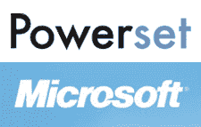

# 就微软收购 Powerset 一事采访 Barney Pell 和 Ramez Naam:年底整合 TechCrunch

> 原文：<https://web.archive.org/web/https://techcrunch.com/2008/07/02/interview-with-barney-pell-and-ramez-naam-about-microsoft%e2%80%99s-powerset-acquisition-integration-to-begin-this-year/>

 今天早些时候，在微软宣布[收购 Powerset](https://web.archive.org/web/20221207193442/http://www.beta.techcrunch.com/2008/07/01/ok-now-its-done-microsoft-to-acquire-powerset/) 后不久，我与 [Powerset](https://web.archive.org/web/20221207193442/http://www.powerset.com/) 联合创始人兼首席执行官 [Barney Pell](https://web.archive.org/web/20221207193442/http://www.crunchbase.com/person/barney-pell) 和微软 Live Search 项目总经理 [Ramez Naam](https://web.archive.org/web/20221207193442/http://www.crunchbase.com/person/ramez-naam) 进行了交谈。

微软打算将 Powerset 的自然语言搜索技术作为一个主要的差异化因素来对抗头号搜索玩家谷歌(参见我们最近对 [Live Search Cashback](https://web.archive.org/web/20221207193442/http://www.beta.techcrunch.com/2008/05/22/the-empire-strikes-back-our-analysis-of-microsoft-live-search-cashback/) 的报道，这是微软的另一项搜索努力，旨在获得[更多的市场份额](https://web.archive.org/web/20221207193442/http://www.beta.techcrunch.com/2008/05/23/danny-sullivan-debates-the-rest-of-us-on-microsoft-cashback/))。

TechCrunchIT 详细介绍了 Powerset 作为一种武器有多有效。但是有几件事是清楚的——减缓 Powerset 发展的资源限制(现金和计算资源)现在已经成为历史。相关性问题不太重要，因为微软核心搜索相关性很好。即使数据集有限，用户似乎也很喜欢 Powerset 的测试版。

Naam 表示，5%的搜索包含基于关键词的搜索算法不能很好处理的自然语言元素，并且有一个假设，随着更好的结果返回，更多的人可能会开始简单地输入一个普通的句子，而不是几个关键词。Naam 说，到今年年底，微软将把至少部分 Powerset 技术整合到微软 Live Search 中。我希望我们很快会听到更多来自微软的关于自然语言搜索的消息。

完整的采访记录在下面，你可以在 [TalkCrunch](https://web.archive.org/web/20221207193442/http://www.talkcrunch.com/2008/07/02/interview-with-barney-pell-and-ramez-naam-about-microsofts-powerset-acquisition/) 听 MP3。

* * *

迈克尔·阿灵顿:你好，我是 Techcrunch 的迈克·阿灵顿。今天我连线了 Barney Pell，他是 Powerset 的联合创始人兼首席执行官，Powerset 已经被微软收购，或者实际上已经宣布将被微软收购，今天早些时候 ancones 已经发布。从微软我也有 Ramez Naam 的电话。他是微软 Live search 的团队项目经理。欢迎各位。

Ramez Naam:谢谢。

巴尼·佩尔:谢谢你。

马:我想问一下，今天到底宣布了什么？你宣布你已经签署了一项协议，但还没有完成。

RN:是的，我们已经签署了协议，但是交易还没有发生，但是我们已经同意 Powerset 成为微软 Live search 团队的一部分的所有条款。

马。在这一点上，有什么可能发生的事情可以阻止关闭吗？

RN:在这一点上，任何阻止关闭的事情都是非常非常出乎意料的。

马:好的，你认为完成这笔交易，或者更重要的是真正整合团队，利用微软的资源推动产品前进，需要多长时间？

RN:嗯，完成交易，需要一段时间，不会太长，至于整合团队，我想我们会立即开始。这是一个短期和长期的任务:短期来看，我们认为 Powerset 有一个了不起的团队，像 Tim Converse，Chad Walters，Lorenzo Thione，Scott Prevost，Barney 这样的伟大人物，他们将在今年年底之前对 Live Search 产生重大影响，你将看到重大的变化，长期来看，正如 Barney 喜欢说的，这是一个 20 年的愿景，真正理解页面是什么，查询是什么意思。这是人工智能、计算机科学的前沿，我们将在未来相当长的时间内致力于此。

马:Ramez，你说过你会马上整合车队吗？

RN:是的，本质上是的。

马:好的，所以实际上交易完成了，这意味着交易完成了，从一个局外人的角度来看，你们是一个公司，你们现在正在前进。

RN:我们现在当然正在制定我们的计划，并讨论我们将要开始做什么。在交易真正完成之前，你不会看到任何影响，但我们有很多想法和很多对话。
马:Barney 我想，在我们讲得太多之前，我想让你介绍一下 Powerset 的背景，就几分钟，关于你最初有这个想法的时候，你创立公司的早期，就几分钟，以及你创立 Powerset 的基本想法。

BP:好的，很好。3 年前，我是风险投资公司梅菲尔德的常驻企业家。我一直在关注搜索的未来，以一种开放的、有远见的方式展望未来，关注主流趋势。我以前有很多人工智能的背景，从研究实验室获得先进的人工智能技术，并让它们进入世界。无论是通过关键任务，还是 NASA 的任务操作，当我在 NASA 时的宇宙飞船，或者互联网搜索相关技术等等。

我可以看到，随着时间的推移，将会有大量的计算能力变得可用，人工智能，特别是自然语言方面的大量工作，已经接近商业就绪的时间，这两种趋势将会融合，就像搜索成为我们与计算机交互的中心，并利用互联网上的所有信息一样。所以，我真的可以看到有一系列的趋势将会汇聚起来。它看起来像是一个完美风暴的中心，然后我看到了这个愿景，出去评估这个自然语言技术在不同的团体和研究组织中有多好，确定了使它大规模工作的关键要求，自然语言搜索必须具有什么样的属性才能大规模工作，经济学现在将如何工作，现在真的是正确的时间。在我对不同技术的评估中，我发现 PARC 的技术，经过 30 年的发展，已经到了可以拿出来商业化的时候了。原则上应该可以大规模运作。我开始和 PARC、罗恩·卡普兰和他的同事丹尼谈判，罗恩·卡普兰在那里领导自然语言小组已经 30 年了。这些都是计算语言学的基本成员。

与此同时，我发现还有另一个相关的团队，他们使用同样的 PARC 技术，已经在研究基础上寻求将其应用于搜索，这些人是富士施乐帕洛阿尔托实验室的人，包括 Lorenzo Thione 和 Powerset 的其他两个关键人物。他们在研究方面也有类似的愿景，他们已经在研究 PARC 的技术，他们说这应该可以工作。所以，我们实际上有一个共同的愿景，我们所有人的共同认识，这是可能的。洛伦佐会马上说，“我们去做吧，你知道我想加入你”，然后成为联合创始人。

然后，我们花了很长时间与 PARC 谈判，以建立正确的团队和合作伙伴关系，并最终为这项技术开发一个非常强大的许可证，为每个人服务。在那段时间里，我们结束了，我们偷偷摸摸了一段时间，我们雇佣并建立了一个伟大的团队，筹集了几轮资金，基本上建立了我们的产品。我们不得不建立许多具有挑战性的基础设施，从研究实验室中获取自然语言技术，并真正使其大规模运作。组建一个世界一流的搜索团队，让像 Chad Walters 和 Tim Converse 这样的人加入进来，带来他们的专业知识，弄清楚如何利用自然语言和最好的搜索来大规模地工作，然后建立一个产品和用户体验团队，能够以用户能够理解并能够看到差异并喜欢它的方式来工作。

最终，在我们雇佣了第一批员工两年后，我们在几个月前推出了我们的产品，在维基百科上展示了这一功能，而回应，你知道我们谈到了这个麦克，我们得到的回应是人们普遍非常喜欢这个系统，他们只是想在整个网络上拥有它。我想这是一次基本的公司历史之旅。我们雇佣员工才 2 年，现在公司有 63 人。

马:这 63 人中有多少是搜索工程师和科学家？

BP:大部分都是。

马:好吧，你筹了多少钱？

BP:我们报道了我们的首轮融资，我们筹集了 1250 万英镑，其中包括我们的天使桥融资。在那之后我们实际上没有报告任何事情；很明显我们筹集了更多的钱，但是我们你知道，我们什么都没报告。

马:收购价格是多少？

BP:我们不是在讨论这个吗？

马:真的吗？一个大概的数字怎么样？所有人都说一亿美元就这么结束了？

BP:我们甚至没有讨论棒球场，我们没有一起谈论它。

马:这是一个伟大的公司背景，但让我们谈谈你实际上做了什么不同的思考雅虎！或者谷歌搜索或微软今天的基于关键词的搜索，我想回到你一年多前的一篇文章，可能是一年半前，我想是在你的个人博客上，在那里你第一次谈到了 Powerset，以及你试图实现的目标。从非技术的角度来看，你对帮助用户搜索有什么看法？

RN:一种思考方式是，今天的系统并不真正理解语言，所以他们不理解用户真正在说什么，用户查询背后的意图，他们也不理解他们正在阅读的文档，他们最终试图让用户找到，顺便说一句，他们不理解广告。所以他们真的什么都不懂，他们很大程度上是基于统计特性。这种特殊的字符流在特定页面的正确位置出现的频率是否正确？都符合吗？作为一种基本的方法，它做得很好。

现在如果你想想，如果你有一个能理解语言的系统，你能做什么？如果我能阅读呢？如果它已经读取了您感兴趣的文档集合中的所有内容呢？是像维基百科那样的小范围收集，还是潜在的整个网络？这对你有什么帮助？这在很多方面都有帮助。第一，你可以使用更自然的查询，只要说出你的真实意图。这是一个完整的句子或者一个问题，或者只是一小段语言短语，或者只是一些人的名字。但它可以更好地理解，它可以弄清楚你想做什么，以及我如何帮助你。然后在内容方面，如果它真的可以阅读，那么它可以更好地将您的查询的含义与文档中的实际含义进行匹配。此外，它可以为您呈现结果，当您查看搜索结果时，您通常会遇到一个挑战，您会看到一小段两行字符，您必须从中找出，这是我真正想要的吗？因为我们今天的系统实际上并不理解查询，也不理解文档，它们真正能显示给你的只是你所询问的关键词在正确的区域中的大致匹配位置。但是如果他们真的能理解文档和你的查询，那么他们就能呈现结果，首先，更好的两行，或者潜在地一种全新的呈现。

马:打断一下，在我听到你说这是谷歌和其他搜索引擎寻找关键词批次，然后根据某种算法显示结果排名，这种算法决定了一个页面的重要性。你之前说过 Powerset 所做的是预读内容。它使用人工智能实际上试图理解句子的意思，在今天的 live search 博客帖子中，微软宣布了他们谈到的几个例子，你知道，灌木和树是相似的概念，这是一个例子，或者癌症这个词可能意味着疾病或星座。如何…也许你想跳到这里来。这实际上是如何发生的，以及…一台计算机接收到一个句子，你的服务器看到一个句子，它实际上是如何开始解析这个句子的，就像你所能描述的一样，这也不是技术性的。

BP:好的，我会带着它，Ramez，你可以加入你的例子。

注册护士:太好了

BP:我想一种思考方式就像你在小学学习如何图解句子一样。你画出这些句子的树，发现这里是名词短语，名词短语有一个限定词，像“the ”,然后它有一个名词，像“dog ”,这里是一个动词短语，它可能有一个动词，像“barks ”,然后它是什么意思，bark 是一个动词，它在结尾有一个“S ”,它的工作方式，我们称之为形态学，这是那个动词的现在时态。然后整个句子是由这些片段组成的，所以意义是由这些片段构成的。所以你在学习如何做的时候会画这些图。像 Powerset 这样的自然语言处理系统所使用的知识有点像这样。它基本上提取出表面结构，即一个句子的树状结构，然后将其转换成一系列不同的表示，最终转换成一个事实上表达该事物的表示。所以它基本上会说，这里有一种活动，这是一种吠叫活动，做这种活动的东西，这种活动的主体，是一只狗。好的。所以这是从你所看到的语言的表层结构出发，将其转化为语义因素的表达。此外，它还能够利用单词之间的个别含义和关系，所以如果你看到句子说“狮子狗叫”然后，如果系统能够像 Powerset 一样利用其他关于单词之间关系的知识，它就知道贵宾犬是一种狗。因此，如果你作为用户能够说，“我想要狗叫”，那么它实际上可以将狗的概念与狮子狗的概念进行匹配，它将狗叫与狗叫进行匹配，然后它会为你进行这种语义匹配，使用你甚至没有在查询中使用的单词，并将这些单词与文档进行匹配。

RN:我认为巴尼说的一切都是对的。我想你会看到包括 Live Search 在内的搜索引擎，谷歌和雅虎也开始在这方面做更多的工作，不完全是用户输入的内容，但通常仅限于非常简单的内容。所以现在我们所有人都做一些缩写词的扩展或者首字母缩略词的扩展。最近几年，如果你在搜索引擎中输入“NYC ”,它能理解它和纽约的意思。这些都是非常非常简单的基于规则的事情，没有人理解树皮如果是关于一棵树就有一种意思，如果是关于一只狗就有不同的意思。或者前几天有人举的一个例子是“被某某人陷害了”的问题。诬陷可能意味着一幅被诬陷的照片，也可能意味着为没有发生的犯罪活动做准备，等等。你必须真正理解它是一个人的名字，然后它适用于这个词的一种意义，如果它不是，那么它就不是。因此，Powerset 带来的一个独特之处是能够将他们的搜索技术应用到用户的搜索查询中，而不仅仅是简单的复数或添加“-ing”，Powerset 还会查看文档，查看网页上的单词，这实际上非常重要。如果你只看用户的查询，你能得到的数字是三个词，四个词，五个词，甚至更少。可以给你一些提示。如果你看到一个网页上有成百上千的单词，如果你从语言学上理解它，你就有更多的信息可以用来告诉你它是关于什么的，什么样的查询应该匹配，什么样的查询不应该匹配。Powerset 已经相当大规模地在索引中应用了这项技术，这是相当独特的，有了微软的投资和长期承诺，我们可以进一步扩展这项技术，甚至在更多的网络上应用这项技术，而不仅仅是他们目前拥有的维基百科内容。

马:Ramez 今天之前微软在这方面做了多少工作？这是你们一直在酝酿、感兴趣的事情吗？你们的员工中有没有这方面的专家，有没有围绕这一领域开发技术的人？想知道你迄今为止在这方面做了些什么。

RN:微软在自然语言处理方面有一些领军人物。我们已经在机器翻译中应用了这个想法，从一种语言翻译到另一种语言，以及自然语言的其他领域，甚至像微软 Word 中的语法检查器这样的东西也以某种方式来自我们的自然语言工作，这是非常令人兴奋的。关于 Powerset 团队的事情是，它纯粹是附加的，就像我与微软研究院内部的人谈论过的那样，他们非常兴奋。他们将旧金山的 Powerset 团队视为伟大的合作者，并将此视为交换数据、想法、工具等的绝佳机会。所有这些都将直接帮助我们。这也是我们第一次有一个专注于自然语言搜索的团队，而不是一个更广泛的领域。有了这种专注的努力和 Powerset 团队已经建立的伟大技术，我们将能够取得真正快速的进展。

马:你们今天的搜索引擎在哪里？他们在华盛顿，还是在你山景城的办公室？

RN:我们团队的大部分在雷蒙德，我们也有一个小团队在山景城。

马:Powerset 现在还在旧金山的办公室吗？

RN: Powerset 绝对会留在旧金山。他们有一间很棒的办公室。我打算一周去那里呆几天。这是一个非常棒的位置，我们希望扩大团队，所以我们正在寻找越来越多合格的搜索工程师和越来越多的计算语言学家加入 Powerset 的团队，并不断扩大规模。

马:巴尼，你们有多少人是现任员工，有多少人以前在微软工作过？有人在离开微软后被重新聘用吗？

BP:实际上我没有数过。我觉得我们有几个微软的人，但是比例不高。

马:阻碍 Powerset 的一个明显的问题是，你需要用一种不同于今天搜索引擎索引的方式来索引整个网络，因为你说你在阅读网页，而不是只注意关键词，你公开说你还不准备这样做，因为这需要钱，你想先用维基百科的测试产品来证明这一点。除了用这种方式索引网络的成本更高之外，很明显，既然你是微软的一部分，费用就不是一个大问题了。如果你打开了 gas now 的最大音量，并想启动一个完整版的 Powerset 来索引网页，我们最快能在什么时候看到它。

BP:嗯，我们只是作为一个团队聚在一起，看看技术整合，看看我们的团队合作的最佳方式，以及我们将如何结合和真正利用微软的资源，所以现在说要花多长时间才能看到还为时过早。我能说的是…

马:巴尼，你是受过媒体训练的。

(笑声)

马:(嘲讽地)我们是微软。我们不能对未来的产品发布发表评论。你给了我三十秒的时间。

BP:不，不，我为它作序(笑声)。我还没说完。说了这么多我能说什么或不能说什么，我想我能说的是 Powerset 已经做了一些处理网页的实验。任意的，随机的网页，这些结果看起来很不错。这已经是一个非常并行的系统，所以在某种程度上，你现在看到的基本体验可以通过运行微软已经拥有的更大的内容集来复制，使用我们在微软已经拥有的机器上运行的技术。这并不意味着你将获得完整的搜索体验，因为微软开发的所有其他功能，我们都希望集成在一起，以提供真正连贯和良好的搜索体验。但是您看到的一些东西已经像 Powerset 从文档中提取的事实一样，可以自动构建您拥有的任何类型概念的配置文件，并且能够显示带有自动生成的摘要的页面。这些功能中的许多功能确实可以实现，至少在今天的质量水平上，只需在微软的基础设施上用现有的资源运行即可。因此，我们必须弄清楚我们开发的顺序，但是我们认为，从根本上来说，将它提升到网络规模的挑战，以及阻碍我们与微软合作的主要障碍，现在已经消除了。

答:巴尼在这里真的展示了他的媒体训练，我真的印象深刻。他的回答也非常正确，要记住的是，在这一点上，主要是团队中的高级人员在讨论。我们在搜索领域确实有一种自下而上的文化。我认为 Powerset 也是如此。因此，既然我们已经宣布了这一点，我们将联系越来越多的工程团队，我们可以开始制定详细的计划。我们非常有信心的是，这是一个很好的组合，有很好的人。文化实际上非常相似，这在战略上是正确的，我们认为这是客户获得高质量结果的巨大障碍。你会看到一些短期的东西。我们肯定会在今年年底之前在 live search 网站上发布一些内容。然后，正如 Barney 所说，我们将采用当前的技术，并开始向外扩展。我们会从维基百科直接进入整个网络吗？我们会有一些过渡材料吗？我还不确定。但随着时间的推移，我们将开始扩大规模，为客户带来越来越多的好处。

马云:你认为你会在 live search 上推出这项技术，还是会在 Powerset 上推出一些东西，并暂时保持两个品牌的分离？还是你放弃了 Powerset 品牌？你想过吗？

RN:我们将保持 Powerset 的活力，我们认为这是一个奇妙的技术展示，我们可能会一直有一些非常有趣的东西来播放和展示给人们，但还没有完全准备好向我们的所有客户展示。但对我们来说，真正的回报是将 Powerset 技术深入整合到 live search 中，并真正使该产品成为除 Powerset 之外真正闪耀的产品。我们希望利用 Powerset 的技术，真正拓宽它，用 Powerset 带来的好处影响数千万人，如果不是数亿人的话。

马云:去年 12 月，谷歌研究主管彼得·诺威格(Peter Norwig)接受采访，他说了一些关于自然语言搜索的有趣事情，当我们发布播客时，我会链接到这些内容，但他说的话，我会引用他的话。我很想从产品和科学的层面上了解你们的反应。“我们认为，与关键词相比，能够提出问题并不是一个很大的进步。输入法国首都不会比输入法国首都得到更好的结果。”对我来说，这根本没有真正回应 Powerset 承诺要做的事情，以及它已经在维基百科上做的事情。但他接着谈到了他认为自然语言搜索的极限价值。他说，“我们认为自然语言搜索的重要之处在于将单词映射到用户正在寻找的概念。”他举了一些例子:纽约和约克不一样，但是维加斯和拉斯维加斯是一样的，泽西和新泽西可能一样也可能不一样。这是我们关注的自然语言方面。我们所做的大部分是在单词和短语的层面上。我们没有把注意力集中在句子上。我们认为获得正确的结果比改变界面更重要。你对此有何回应？

RN:我认为彼得·诺威格所说的有一定程度的准确性，他也忽略了一些事情。所以，仅仅对于普通的查询，那些不用问句表达的查询，有很多语言结构。如果有人键入查询“两居室公寓，低于 1000 美元，在 Portero 山一英里内。”该查询加载了语言内容。这是一个现实的问题。这才是顾客真正想在网上找到的东西。今天有一种无奈，顾客知道某些查询太复杂，他们甚至不会把它们发给搜索引擎。他们会去一些深度垂直搜索引擎，在那里他们可以将不同的数据输入到不同的框中。法国的首都是什么？这并不是一个真正有趣的领域。但是一些更复杂的查询确实是。例如，灌木对树木。如果我为我的院子搜索装饰性灌木，而理想的网页上有我花园的装饰性小树，它真的应该匹配那个网页，并作为一个好的结果显示出来。但是今天谷歌不干了，雅虎不干了，Live 也不干了。所以即使在这些普通的查询中，也有很多语言学上的价值。

BP:没错。所以另外，Powerset 刚刚推出了产品，我认为一些功能在我们刚刚推出的 iPhone 产品中得到了很好的体现。这只是我们网站的另一个版本，但是是为 iphone 设计的。迈克，你已经在博客上写了。自从我们发布以来，我一直在移动设备上使用 Powerset，这有点可笑，因为你的空间非常有限，你知道你脑子里想要什么，但你知道页面出现需要很长时间。我看了一部电影《钢铁侠》,我想知道杰夫·布里吉斯还出演了哪些电影？你想怎么问这个问题？你想如何获得信息？你想说杰夫·布里吉斯主演过什么电影吗？钢铁侠里那个金发记者是谁？你怎么能问这个问题？所有这些我们在大脑中用语言思考的东西，然后我们必须想出如何翻译它。这并不意味着您必须进行更多的输入才能得到更差的结果，而是意味着您应该能够用最自然的方法做任何事情。我们是人类，语言是我们独特的人类天赋，然而我们在与机器互动时却无法利用这一点。

马:等等，等等，等等。所以我大概已经上网 13 年了，我知道不应该在搜索栏里输入一个句子。我会做的是…

BP:那就是习得性无助。

马:是的，但是我想输入钢铁侠，然后从那里找到那个金发记者的名字。我已经学会这样做了，因为我已经使用互联网很长时间了。你认为现在还有人用这种方式搜索长句吗？似乎我们在早期尝试过，并意识到它不起作用。那么，有没有人费心去这样搜索呢？接下来的问题是，Barney，关于你在维基百科引擎中看到的，你是否看到随着人们学习与搜索引擎对话，较长的查询会慢慢发展？

BP:让我来回答这个问题:真的有人这样搜索吗？答案是肯定的，人就是这么干的。这不是最常见的模式，但是我们确实看到大约 5%的查询是自然语言查询。这些查询并不都是用完整的句子表达的，但是它们是客户发出的具有某种语言结构的查询。几乎任何带有介词的查询:X 和 Y，A 靠近 B，Y 的属性 A 等。这些东西承载着语言结构。

BP:这里有几个片段。一个是有人做事吗？我想我们都有这样的经历——如果你只是得到最基本的表达式查询，而你的系统返回一个足够好的结果，你就完成了，你很高兴。当你第一次没有得到结果时会发生什么？你有挫败感的时候，你知道你在做一个项目。发生了什么是祈祷的时刻，在那里你基本上已经尝试了一些不同的版本，你只是感到沮丧，你如何表达你的疑问？你表达你的祈祷，你说让我说我想说的，我知道我不会得到结果，但该死的，我只是要戳。

马:我想这就是为什么雅虎问答经常出现的原因，因为他们的问题实际上是问题的引用。其他人已经问过并回答了它，但这可能不是答案的最佳来源，但它是搜索引擎可以找到的将我发送到的最佳位置。

RN:我面前有一些自然语言查询的列表。我们能否向您展示一些我们的客户实际发送给我们的询问，这些询问是随机的例子。第一个看到月球阴暗面的人。如何在马来西亚获得信用卡？在域控制器上的组策略中启用系统还原。英伟达的时间线。如何测量窗帘？女士和女士的尺码有什么区别？我的宝宝有胃酸倒流吗？我可以继续下去，我。这些符合我们标记的类别，匹配约 5%的查询，它们实际上只是客户无法想到更简单的方式来表达它的情况。

BP:现在我将详细说明 Mike 关于你的问题的第二部分，这是 Powerset 推出的，我们是否看到用户实际上在做关于自然语言的任何事情，以及查询看起来是否完全不同。

马:是的。

BP:答案绝对是肯定的。我们的用户在向系统投掷更长、更有趣、更复杂的东西方面完全没有问题。你知道，这只是一个洪水，所以当我们在发布时看到最初的查询时，这对我们来说是一个有趣的时刻，因为这是一些最初的声誉。没有关于用户是否可以在日常生活中使用英语或表达自己的方式的问题，如果有机会，他们是否可以通过搜索引擎做到这一点。当然，如果给用户机会，用户会去做，也会去做。我想回到另一点。我们不想在查询端和意图表达端隐藏所有内容，因为您将看到的所有这些数十亿个文档都加载了语言。因此，提前阅读它们并提取关键信息然后使用它们的能力，即使您只是通过自动生成配置文件来进行一个小小的简单查询。比如说亨利八世，我想你已经在博客上提到了迈克。或者，当你读一篇文章时，给你文章的摘要。

马:你有时会返回答案，而不是网页，这很神奇。

BP:我们返回答案。我们实际上是合成的，所以如果你说，“汤姆·克鲁斯主演了什么，”你实际上得到的不仅仅是电影，而是不同电影的封面艺术。它综合了多种信息，给你一种完全不同的展示。或者，如果你只是说“比尔·盖茨”，你会得到一个自动生成的比尔·盖茨的简介，它会在很多很多文章中出现。它不再仅仅是 10 个链接，尽管我们当然可以对蓝色链接做更多相关的工作(和意愿),并更好地展示这些链接。有了我们现在拥有的语言理解系统，我们可以走得更远，在用户体验方面打开一扇全新的门，直到你认为，“哦，上帝，我以前就是这样搜索的，现在我想要这种全新的不同类型的东西。”现在的问题是，用户在问，我如何在整个网络上获得它，通过这种合作关系，我们现在将提供它。

马:好吧，我没问题了。这真的很有帮助。我还有很多其他的问题想问，但是你还没有回答。我期待看到 Powerset 技术推出，并提供完整的 web 索引和背后的微软排名技术。我觉得会很棒的。Ramez 你是承诺一个完整的发布，还是某种形式的在年底前发布？你之前在播客中提到过。

RN:我要说的是，到今年年底，你肯定会看到 Powerset 技术改善了用户在 Live Search 上的体验。

马:好的。好了，伙计们，非常感谢你们的时间，祝贺你们两位。

BP:嘿，谢谢你，迈克。再见。

注册护士:再见。