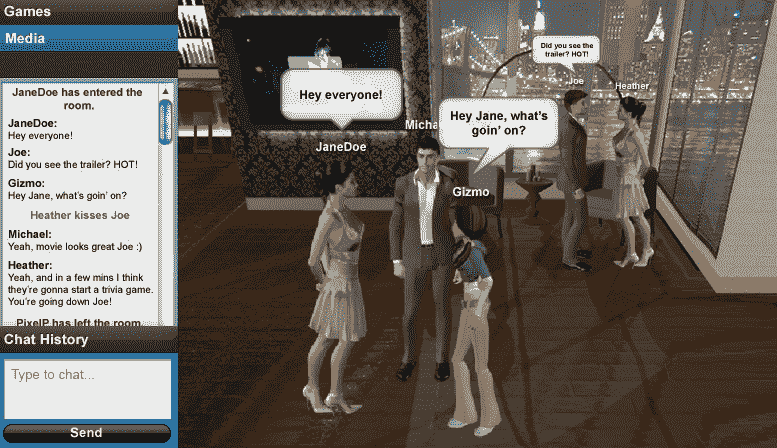

# 更多基于浏览器的虚拟世界:电动绵羊公司发布 WebFlock | TechCrunch

> 原文：<https://web.archive.org/web/https://techcrunch.com/2008/07/17/more-browser-based-virtual-worlds-the-electric-sheep-company-releases-webflock/>

# 更多基于浏览器的虚拟世界:电动绵羊公司发布 WebFlock

西布利·韦贝克正在经历第二人生。电子羊公司的首席执行官在第二人生中为 CBS、Showtime 和英特尔等大品牌创造虚拟岛屿，赚了很多钱。但是现在他准备在普通浏览器中将这些虚拟世界带到网络上。今天，他发布了 [WebFlock](https://web.archive.org/web/20230313073251/http://www.electricsheepcompany.com/webflock) ，这是一款基于 Flash 的 3d 虚拟世界应用，他以托管软件服务的形式提供。

WebFlock worlds 是私人标签的虚拟环境，针对的是那些希望在网上拥有 3D 形象的大品牌，这比 Second Life 等需要单独下载软件的世界更容易访问。尽管今年到目前为止，我们已经看到[、3.45 亿美元](https://web.archive.org/web/20230313073251/https://techcrunch.com/2008/07/08/virtual-worlds-are-so-hot-right-now-345-million-invested-so-far-this-year/)投资于虚拟世界初创公司，但这些世界向浏览器转移是一个明确的趋势。例如，最近推出的虚拟世界初创公司 [Vivaty 完全基于浏览器](https://web.archive.org/web/20230313073251/https://techcrunch.com/2008/07/08/vivaty-brings-the-3d-web-to-your-browser-starting-with-aim-and-facebook/)，谷歌正在[试验其基于浏览器的虚拟环境 Lively](https://web.archive.org/web/20230313073251/https://techcrunch.com/2008/07/08/google-launches-virtual-world-called-lively/) 。

然而，这些努力都不是基于 Flash 的。它们只在 Windows 机器上工作(因为它们接入 ActiveX)。WerFlock 世界可以在任何支持 Flash 的浏览器中查看(即几乎所有浏览器)。它支持 3D 头像、聊天、虚拟货币、游戏以及来自 YouTube 和网络其他部分的嵌入图像和视频。

韦贝克正在向他在《第二人生》中为之创建虚拟岛屿的同类大品牌提供 WebFlock 托管服务。例如，他的第一个客户是 Showtime 的*L 字*，它已经有了一个最受欢迎的第二生命岛(由电动羊创造)。通过将同样的虚拟环境引入浏览器，Showtime 认为它可以接触到更多的观众。

Verbeck 采用了 Electric Sheep 用于创建其他虚拟环境的相同底层技术，称为 Aspen，现在正将其应用于基于浏览器的世界。他设想这些 3d 世界是集成到不同网站上的独立空间。将它们连接在一起会使它们更有趣。

WebFlock 并不便宜。一个“基本实现”，包括一个三维空间，头像和基本功能，将花费 12 个月“不到 10 万美元”。他并没有完全放弃他的第二人生业务，但这一新的重点表明，他看到了与网络其他部分隔绝(或至少难以进入)的虚拟世界的前景。

