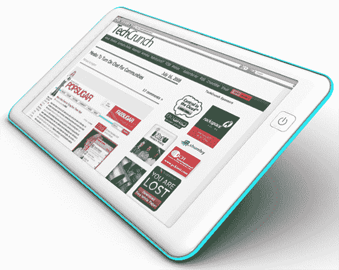
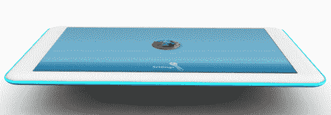
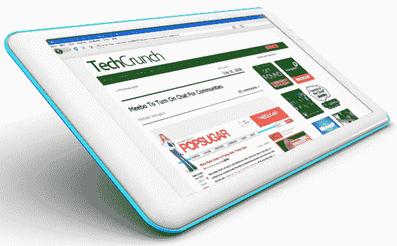

# 我们想要一个 200 美元的非常简单的网络平板电脑。帮助我们建造它。TechCrunch

> 原文：<https://web.archive.org/web/https://techcrunch.com/2008/07/21/we-want-a-dead-simple-web-tablet-help-us-build-it/>

我厌倦了[等待](https://web.archive.org/web/20230203143715/http://www.macrumors.com/2008/05/23/tablet-mac-coming-in-fall-2008/)——我想要一个非常简单和非常便宜的触摸屏网络平板电脑来上网冲浪。没有比售价 2500 美元的戴尔 latitude XT 更高档的了。只是一台 Macbook 超薄触摸屏电脑，在 Linux 内核上运行 Firefox，可能还有 Skype。它现在不存在，而且据我们所知，没有人在创造它。因此，让我们设计它，建造一些，然后开源规格，这样任何人都可以创建它们。

这是基本的想法:机器尽可能薄，运行低端硬件，有一个开关电源的按钮，耳机插孔，内置摄像头，低端扬声器和麦克风。它将有 Wifi，可能有一个 USB 端口，内置电池，半千兆字节的内存，4 千兆字节的固态硬盘。数据输入主要是通过一个类似 iPhone 的触摸屏键盘。它运行在 linux 和 Firefox 上。如果它完全建立在开源硬件上，那当然很好，但是将 Skype 用于 VOIP 和视频通话也是一个不错的选择。

如果你所做的只是运行 Firefox 和 Skype，你不需要很多硬件马力，这将使成本大幅下降。

这个想法是打开它，绕过任何桌面界面，直接进入 Firefox，运行在一个修改过的 [Kiosk 模式](https://web.archive.org/web/20230203143715/https://addons.mozilla.org/en-US/firefox/addon/1659)中，有效地将浏览器变成设备的操作系统。为谷歌文档、电子邮件等添加离线同步工具。和 Skype 进行通信，你就拥有了一台几乎和台式机一样有用的机器，但比任何笔记本电脑或平板电脑都更便宜、更便携。

它还将包括一个定制的默认主页，带有书签服务的大按钮——新闻、即时消息的 Meebo/Ebuddy、办公、电子邮件、社交网络、图片网站、YouTube 等的 Google Docs/Zoho。你每天使用的所有东西。

我们正在与一家供应链管理公司合作，该公司表示，我们希望制造的基本机器只需几百美元。他们需要我们编写对 Linux 和 Firefox 的软件修改(下面会详细介绍)并指定硬件规格。然后他们用它运行，一个月内就能造出几个原型。

我们叫它什么？我能想到的最好的名字是 Firefox 平板电脑，但这需要与 Mozilla 进行一轮讨论。

**这里是** 的计划

我们将组织一个小团队来检查这一点。首先是营销文件，只是概述了机器将做什么——我们已经有了第一份草案，并将很快发布。然后，我们将详细说明硬件，并让人们帮助编写定制的 Linux 和 Firefox 代码。一旦我们完成设计，我们将开始与供应链公司合作，了解机器的成本(目标是 200 美元)，并有望制造一些原型。任何对这个项目有重大贡献的人都会得到第一台样机。如果一切顺利，我们将开放设计和软件的源代码，让任何人都可以建造一个。

目标是保持机器非常简单和非常便宜。我认为这会很有趣，它可能会变成一个实际的产品，我们可以用它来上网冲浪和与朋友交谈。

我们将在 TechCrunchIT 协调项目[。如果您想参与，请在这里留下您的评论，我们将很快与您联系。](https://web.archive.org/web/20230203143715/http://www.techcrunchit.com/2008/07/21/the-techcrunch-web-tablet-project/)