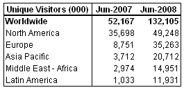
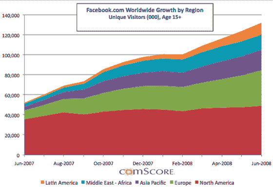

# 脸书增长在全球呈爆炸式增长，在美国趋于平稳 TechCrunch

> 原文：<https://web.archive.org/web/https://techcrunch.com/2008/07/23/facebook-growth-explodes-globally-levels-off-in-the-us/>

# 全球脸书增长呈爆炸式增长，美国持平

康姆斯克刚刚发布了关于脸书增长模式的最新数据，这些数据清楚地表明，脸书最近向海外扩张的努力获得了回报。该网站在拉丁美洲、中东和亚太地区的增长率极高。欧洲的用户基数要大得多，也在继续稳步增长。

北美仍占脸书每月增长的近 40%,但其比率保持相当稳定，在过去七个月中徘徊在大约 47，000 个唯一项的增长上。

今年早些时候，脸书终于设法在 MySpace 的独立访客总数上赶上了 T4，这主要是由于其快速的全球扩张(MySpace 继续在美国市场占据主导地位)。

