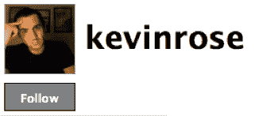
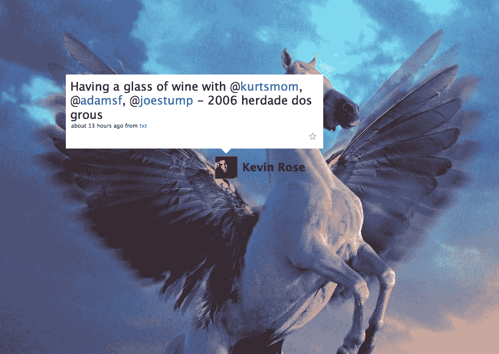
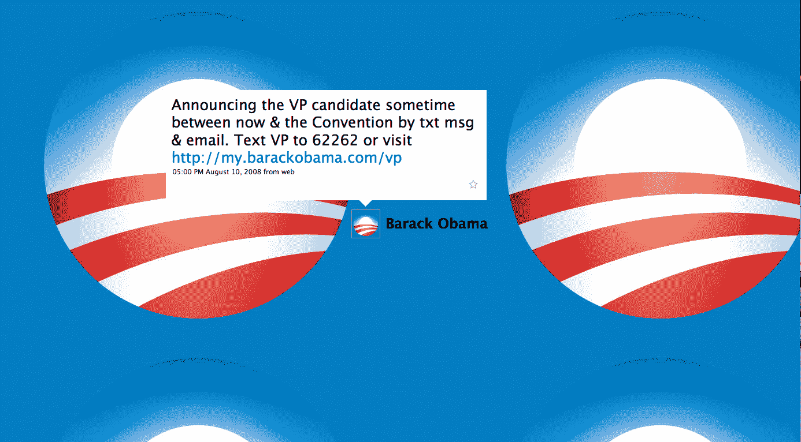

# 巴拉克奥巴马在推特上超过凯文·罗斯。麦凯恩不见踪影。TechCrunch

> 原文：<https://web.archive.org/web/https://techcrunch.com/2008/08/13/barack-obama-overtakes-kevin-rose-on-twitter-mccain-is-nowhere-in-sight-/>

# 巴拉克奥巴马在推特上超过凯文·罗斯。麦凯恩不见踪影。

直到昨晚，微博上拥有最多粉丝的人是 Digg 的创始人和网络名人[凯文·罗斯](https://web.archive.org/web/20221006212150/http://twitter.com/kevinrose)，有 56，482 人关注他的每一个公众想法。正是巴拉克·奥巴马(或者更确切地说，是奥巴马的竞选机器)从罗斯手中夺走了推特的桂冠。知道有 56，791 人订阅了他的竞选推特，奥巴马终于可以昂首挺胸了。

Twitter 上的两个老大有什么不同？而奥巴马会自动追随所有追随他的人，甚至更多:总共有 59474 人。我确信他会阅读每一条推文(总统候选人没有 2000 人的限制)。罗斯对他追随的人更加吝啬。只有 97 个人——但其中一个是巴拉克·奥巴马！。

罗斯喜欢告诉每个人[他在喝什么](https://web.archive.org/web/20221006212150/http://twitter.com/kevinrose/statuses/885983652)(不错的独角兽背景图片，凯文)，奥巴马邀请他的追随者注册，这样他们就可以第一个知道他的[副总统人选将是谁。](https://web.archive.org/web/20221006212150/http://twitter.com/BarackObama/statuses/883563719)玫瑰怎么样？他知道如何获得选票，似乎已经准备好接受新的工作。

奥巴马竞选团队注意:你可能想把背景图片从普通的竞选按钮改成奥巴马的图片。

约翰·麦凯恩呢？他不在前 100 名中。事实上，他在推特圈里无处可寻(这不完全是他的选区)。或者至少，我找不到他。有一个非官方账号， [JohnMcCain2008](https://web.archive.org/web/20221006212150/http://twitter.com/JohnMcCain2008) ，吸引了 1485 名粉丝。但是，麦凯恩[甚至不用电脑](https://web.archive.org/web/20221006212150/http://www.beta.techcrunch.com/2007/11/12/mccain-embarrassed-by-yahoo%E2%80%99s-actions-in-china-also-calls-google-to-the-mat/)，所以你不能指望他会发推特。

这并不重要。这可能是互联网选举，但 Twitter 至少在 2012 年之前不会成为一个因素。或者，它会在选举中比其早期采用者的血统更有影响力吗？

【T6
