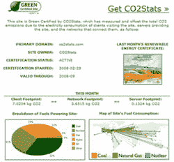

# CO2Stats 补偿你网站的污染| TechCrunch

> 原文：<https://web.archive.org/web/http://techcrunch.com/2008/08/14/co2stats-compensates-for-your-sites-pollution/>

# CO2Stats 补偿你的网站的污染

 昨天 [Y Combinator](https://web.archive.org/web/20230316013333/http://www.crunchbase.com/company/y-combinator) 支持 [CO2Stats](https://web.archive.org/web/20230316013333/http://www.co2stats.com/) 宣布推出一个全功能版本的网站排放测量服务。这次发布是在[发布](https://web.archive.org/web/20230316013333/http://www.alexwg.org/SanJoseMercury071116.pdf)一个用于测试市场和评估用户反应的原型小工具近一年之后。这个想法最终吸引了足够多的媒体和积极的反馈，让创始人将他们的服务和计算提升到一个新的水平。

CO2Stats 通过计算其环境足迹和购买电网中其他地方的绿色电力(如风能、太阳能)来补偿，从而使网站“绿色”。这项服务不仅计算网站服务器的能耗，还计算访问网站的客户端机器的能耗。事实证明，访问者实际上比服务器本身消耗更多的电力。

计算能源消耗的方法是非常严格的，因为像这样的东西必须被接受。该系统考虑了网站服务器和访问者的地理位置、在网站上花费的时间、客户端设备类型(手机、笔记本电脑等)，甚至用户屏幕上页面窗口的大小。

支持这项服务的网站展示了一个清洁能源徽章，当点击它时，会显示访客、服务器和网络产生的二氧化碳排放量，以及用于为网站供电的燃料类型和发电地点的明细。

CO2Stats 收取统一费率，该费率取决于他们发现客户的累计电量。这确保了网站不会因为流量高峰而受到惩罚，并使这个想法对拥有大量用户的网站更有吸引力。如果维护一个“绿色”网站成为公司的标准做法，这项服务将会大受欢迎。信息和通信技术所需的发电目前占全球二氧化碳排放量的 2%,而且这一数字还在不断增长。目前的客户包括[瞪羚](https://web.archive.org/web/20230316013333/http://www.gazelle.com/)，以及一些环境意识网站。