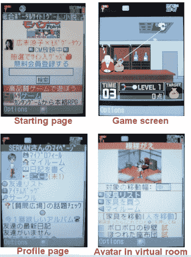

# Mobage-town:日本最大的纯移动社交网络 TechCrunch

> 原文：<https://web.archive.org/web/https://techcrunch.com/2008/08/16/mobage-town-japan%e2%80%99s-biggest-mobile-only-sns/>

# 移动小镇:日本最大的纯移动社交网络

 在美国，围绕移动社交网络有很多宣传和希望，但移动社交网络在西方仍处于羽翼未丰的阶段[。在日本，这已经是现实。特别是一家名为 DeNA T6 的公司，凭借其移动社交网络/虚拟世界/游戏平台 Mobage-town T8 席卷了日本。DeNA 今年早些时候在圣马特奥开设了美国办事处，并计划在今年秋天提供英文版的 Mobage-town。](https://web.archive.org/web/20221206212739/http://www.beta.techcrunch.com/2008/04/09/i-saw-the-future-of-social-networking-the-other-day/)

用户可以交换信息、在社区中聊天、分享音乐、阅读袖珍小说、写博客等等。然而，该网站的“杀手锏”是大量免费游戏的选择，这使得大多数用户首先注册。

1100 万 Mobage-town 成员中的每一个都由“生活”在虚拟房间中的化身来代表。例如，角色和房间都可以用新衣服和墙纸装饰。为了做到这一点，用户必须通过点击广告、注册附属服务和邀请新成员来获得由 DeNA 建立的虚拟货币“Moba Gold”。

循环商业模式为该公司带来了回报，该公司在东京证券交易所上市(市值 23 亿美元)。仅 Mobage-town 今年第一季度的销售额就达到了 4600 万美元，6 月份的页面浏览量接近 150 亿次。是的，这是日本-和移动-唯一。

