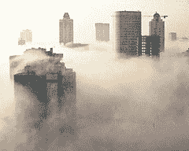
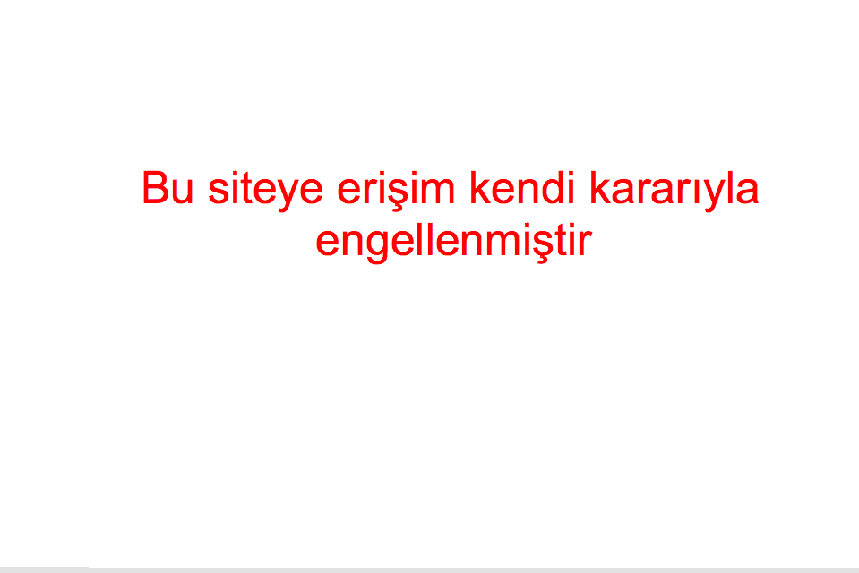

# 土耳其的网络审查如此糟糕，以至于博客纷纷关闭以示抗议

> 原文：<https://web.archive.org/web/https://techcrunch.com/2008/08/17/web-censorship-is-so-bad-in-turkey-that-blogs-are-shutting-themselves-down-in-protest/>

# 土耳其的网络审查如此糟糕，以至于博客纷纷关闭以示抗议

 让你的网站在土耳其被禁并不难。几乎任何向下级法院的投诉都会导致该国网站被屏蔽。包括 YouTube、DailyMotion、阿里巴巴、Slide.com 和一些 WordPress 博客在内的网站都被禁止，通常是因为一些据称对土耳其政府或穆斯塔法·凯末尔·阿塔图尔克的轻视。(Youtube 禁令源于一段声称阿塔图尔克是同性恋的大二视频)。

这个问题已经变得如此糟糕，以至于土耳其博客现在禁止他们自己以示抗议。假禁令始于菲拉特·伊尔迪兹，他在自己的博客上发布了这条信息:

> *Bu siteye eriim kendi Kara RYLA engellenmitir*

大致意思是:

> 对本网站的访问被其所有者的自由意志所阻止。

然后另一个土耳其博主 [Selim Yoruk](https://web.archive.org/web/20230223230619/http://anafikir.com/) 用一段代码创建了[这个页面](https://web.archive.org/web/20230223230619/http://anafikir.com/sansur/)，任何博主都可以很容易地将同样的信息添加到他的主页上。近 200 个土耳其博客以这种方式(暂时)关闭了自己。目的是向土耳其网民展示如果审查继续下去，互联网会是什么样子。抗议将持续到周三。

(照片由[约翰·沃克](https://web.archive.org/web/20230223230619/http://www.flickr.com/photos/whatcouldgowrong/2245309248/)拍摄)。