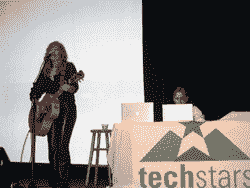

# 十家创业公司亮相 TechStars 演示日| TechCrunch

> 原文：<https://web.archive.org/web/https://techcrunch.com/2008/08/20/ten-startups-debut-at-techstars-demo-day/>

 * **编者按**:下面的实地报道来自**唐道奇**，他在[下一件大事](https://web.archive.org/web/20230329092219/http://microsoftstartupzone.com/blogs/the_next_big_thing/default.aspx)上写博客，是微软的业务发展主管。他今天在科罗拉多州的博尔德参加 TechStars 演示日。与 Y Combinator(上周有自己的[演示日](https://web.archive.org/web/20230329092219/https://techcrunch.com/2008/08/14/y-combinators-demo-day-summer-2008/)和 LaunchBox (最近也有[演示日](https://web.archive.org/web/20230329092219/https://techcrunch.com/2008/08/05/launchbox-unleashes-its-first-nine-startups/))非常相似， [TechStars](https://web.archive.org/web/20230329092219/http://www.techstars.org/)  是一个创业孵化器，它选择 10 个团队，为每个团队提供大约 1.5 万美元的资金，以及免费的办公场所、运营支持和前企业家和商业领袖的指导。*

这是 TechStars 的第二年，他们已经进行了一次收购。 [SocialThing](https://web.archive.org/web/20230329092219/http://www.socialthing.com/) 最近被美国在线[收购](https://web.archive.org/web/20230329092219/http://news.cnet.com/8301-17939_109-10017596-2.html)。这些团队今天首次向大约 100 名风投和天使投资人展示了他们的产品。这些公司成立三到六个月，有两到三个创始人员工。以下是唐对今天将在 TechStars 上展示的 10 家初创公司的记录。

* * *

**吉米**

Gyminee-一个用于详细追踪、在线问责和激励的健身社交网络。有了 Gyminee，你可以找到锻炼计划并跟踪你的进度，跟踪你的食物和营养，并为任何对你重要的事情设定目标。在社交方面，你可以找到 GymBuddies 让你对自己的目标负责，并参加健身挑战。他们已经拥有超过 35000 名用户和超过 120 万的页面浏览量。在营养方面，他们有一个 50，000 种食品的数据库，你可以在标签上找到完整的营养信息。你可以追踪你的饮食、卡路里和营养价值。免费增值商业模式。 **免费的** 服务，在这里你可以每月花 5 美元升级到 **高级** 服务。希望筹集 30 万美元的种子资金。

**点火者**

希望约会能像和朋友出去一样轻松有趣？Ignighter 是组对组约会。像你在现实生活中那样与人交往……就像你在大学里那样。Ignighter 就是把你和你的朋友和其他人以及他们的朋友联系起来。他们认为，集体社交比一对一的相亲更安全，也不那么令人生畏，而且会导致私人约会。Ignighter 为组提供了脸书元素，为日期提供了 Match.com 元素。他们有一个 iPhone 应用程序，可以使用 GPS 找到你当前位置附近的其他团体。他们有超过 10，000 名注册用户。商业模式；优质服务，比如更好的搜索排名，当然还有广告。希望筹集 30 万美元。

**万众软件**

[Peoples 软件](https://web.archive.org/web/20230329092219/http://www.peoplessoftware.com/)–谁在附近？来自 People's Software 的计划和日程安排工具可以直接插入到您的脸书帐户、联系人列表或移动电话目录中，让您与朋友一起制定计划时不再感到痛苦。轻量级和位置感知，WhozAround 对你的朋友进行分类，只需点击一下就可以制定计划，并将你的活动输出到一个干净的 feed 中，可以直接进入你的日历、电子邮件或手机。

人民软件公司的创始人是苏珊·默尼特，她曾是雅虎和美国在线的副总裁，还有丽莎·威廉姆斯，她是几家公司的创始人，曾在 Boston.com 工作。很高兴看到两个女人创立了一个很酷的新公司。商业模式；本地定向广告。他们相信，由于当地的目标市场，并通过与地区媒体公司合作，他们可以获得 7 至 10 美元的 CPM 费率。他们正在寻求 22.5 万美元的种子基金。

**Devver**

[Devver](https://web.archive.org/web/20230329092219/http://www.devver.net/)——将开发人员已经在桌面上使用的工具转化为 *基于云的服务* 。目前专注于 Ruby 工具和测试套件。非常强调测试套件。他们稍后会添加 PHP、Python 和 Java。他们也将有一个开放的 API，这样开发者可以添加其他语言。

通过将开发人员工具放在云中，他们可以更快地执行它们，减少设置和配置时间，实现轻松调度，显示丰富的报告，并使团队成员之间共享数据变得简单。开发工具和环境在基于云的服务器上设置一次，然后团队成员可以快速添加并拥有所有相同的工具、项目和代码。

商业模式；每个开发者每月 100 美元的订阅费。销售渠道——似乎是通过 Ruby 开发社区口耳相传的。寻求 20 万美元的种子基金。

**高速公路女孩**

《高速公路女孩》—是数字时代的巡回音乐秀。该节目由歌手兼词曲作者萨曼莎·墨菲(Samantha Murphy)主持，教育艺术家如何在数字时代管理他们的职业生涯，同时也让粉丝们真正了解巡回演唱的歌手/词曲作者的幕后生活。它最初是基于萨曼莎墨菲，但很快将包括其他艺术家。TheHighwayGirl.com 将出售他们主演的艺人的独家内容，并在艺人和粉丝之间的非传统交易中充当联络人。

萨曼莎发表了我所见过的最不寻常的创业推介之一。她唱了一首关于筹集资金和建立企业的歌。哇！萨曼莎是一个非常有才华的歌手兼词曲作者。商业模式；独家内容，旅游，商品，和一个名为公路女孩的巡回音乐。也和上旋搭档。寻求 50 万美元的种子基金。

**应用专家**

[应用专家](https://web.archive.org/web/20230329092219/http://www.app-x.com/)向风险资本和私募股权基金经理以及投资风险资本和私募股权的养老金、捐赠基金和其他各方提供软件即服务(SaaS)。总部设在丹佛、波士顿和芝加哥。创始人在创办公司之前在私募股权公司工作。

这个想法是建立一个私人股本和风险资本投资者的社交网络，以分享最佳实践和信息。它们还提供了一个交易跟踪仪表板，以帮助管理正在进行的投资交易。

他们的目标受众有的是钱，愿意付费。他们每人收费 3000 美元，最低 15000 美元。

**枕骨**

[枕骨](https://web.archive.org/web/20230329092219/http://www.occipital.com/)——摄影技术已经发展了很多年，但是我们与数码照片互动的方式仍然非常原始。Occipital 正在使用人工智能来组织您的照片流，通过突破性的可视化实现生动的回忆。

它们可以将照片拼接成一幅全景图，自动为照片添加标签，并根据照片构建 3D 场景。他们可以放大，飞越，进入建筑物…所有这些都是基于简单的照片拼接成一个 3D 演示。它们在您的照片中找到对象，并将它们链接到其他照片中相同或相似的对象，并将它们缝合在一起。这很难用语言来解释，但视觉演示是惊人的。

**BuyPlayWin**

[BuyPlayWin.com](https://web.archive.org/web/20230329092219/http://www.buyplaywin.com/)——将网上购物与锦标赛游戏相结合。购买产品，玩游戏，赢得产品退款。通过与其他购物者玩有趣的游戏，每个购物者都有机会赢得所购物品的全额退款。例如，买一本 120 美元的大学课本。与其他六个也在购买这本书的人竞争。赢得比赛，你就可以免费得到这本书。他们用产品的利润来支付赢家的购买。如果一个产品有 33%的利润率，他们需要三个玩家才能达到收支平衡。有了 10 个购买者，他们获得了丰厚的利润。他们正在寻求 40 万美元的种子基金。

Foodzie

Foodzie——一个在线市场，消费者可以在这里发现并直接从小型手工生产者那里购买食物。Foodzie 技术使小生产者可以轻松地在网上销售他们的产品，并将所有这些产品聚集在一个市场中，使“美食家”可以轻松地发现最好的食物。他们专注于美食和有机健康食品。这些都是高端高利润的产品。Foodzie 从每笔销售中抽取 20%的佣金。传统零售商抽取 50%的利润，分销商抽取另外的 10%。食品供应商最后只拿了 40%。因此，有了 Foodzie，生产商可以保留 80%的销售额。他们正在寻求 35 万美元的种子基金。

**Travelfli**

[travel fli](https://web.archive.org/web/20230329092219/http://www.travelfli.com/)-帮助常旅客最大限度地发挥其忠诚度计划的潜力，并发现这种隐藏货币的价值。他们帮助用户在一个集中安全的地方管理他们的奖励计划，找到使用他们的里程获得免费旅行的方法，并在线预订奖励旅行。TravelFli 允许您累计家庭成员的常旅客里程和酒店积分，并跟踪所有各种奖励计划。它们帮助您跟踪里程何时到期，或者何时有针对您的里程的特别促销活动。

有超过 1 . 2 亿人参与飞行常客计划，还有数万亿英里的飞行常客里程从未被使用过。精英会员有 1700 万人，占所有航班的 43%。对于航空公司、酒店、租车公司等来说，这些精英乘客是一个非常有利可图的市场。

商业模式；所有销售的佣金。广告——旅游的 CPM 非常高。他们还将出售航班、酒店和汽车租赁的综合数据。他们正在寻求 50 万美元的种子基金。