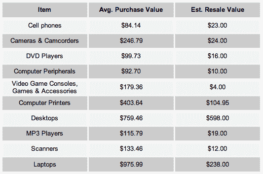

# Ebay 调查显示美国人购买他们不想要的垃圾

> 原文：<https://web.archive.org/web/https://techcrunch.com/2008/08/21/ebay-survey-says-americans-buy-crap-they-dont-want/>

# 易趣调查显示美国人买他们不想要的垃圾

 这个收件箱的项目引起了我的注意。Ebay 委托进行了一项调查，代表他们快速增长的 [Kijiji](https://web.archive.org/web/20230305211744/http://www.kijiji.com/) 产品(它[与](https://web.archive.org/web/20230305211744/https://techcrunch.com/2008/02/27/kijiji-talks-smack-about-craigslist-we-will-be-no-1-in-the-us/)竞争，而[与 Craigslist](https://web.archive.org/web/20230305211744/https://techcrunch.com/2008/05/13/ebay-vs-craigslist-round-ii-craigslist-punches-back-with-its-own-lawsuit/)打官司)。

调查揭示了令人惊讶的事实(我用这个词是讽刺性的)，例如:

*   90%的美国人家里至少有一件没用过的东西
*   超过 2/3 的家庭(70%)可以找到未使用的电子产品
*   38%的男性保留着旧电子产品，而女性只有 35%

想卖掉那些垃圾吗？你不会得到太多。平均购买价格和转售价值如下。Ebay 把这些柠檬变成了柠檬水:“虽然在某些情况下你可能拿不回多少钱，但总比什么都没有强——尤其是在经济困难时期。我们都知道电子产品的价值贬值有多快，所以那些手里拿着第一代 iPhones 的可怜家伙应该尽快脱手！”

快把那东西放到吉吉吉上！另一方面，我希望我们有无限的资金来委托进行随机调查。

