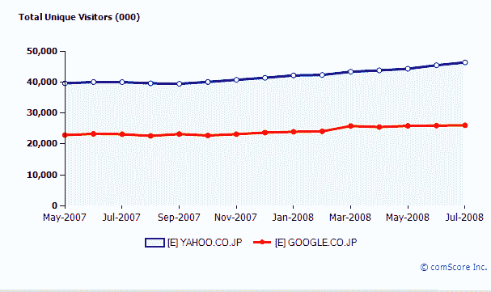
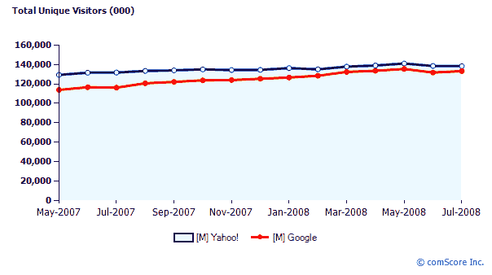
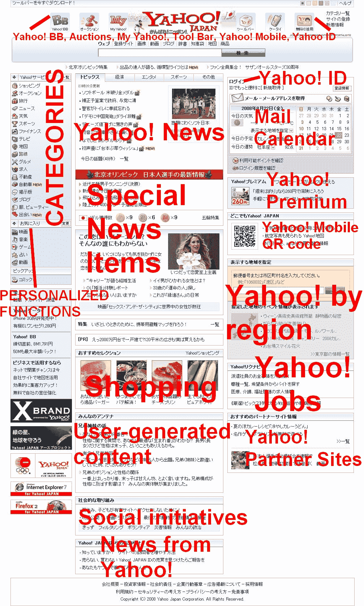

# 为什么雅虎日本的价值几乎和雅虎 TechCrunch 一样高

> 原文：<https://web.archive.org/web/https://techcrunch.com/2008/08/23/3-reasons-why-the-internet-in-japan-is-ruled-by-one-single-company-yahoo/>

 雅虎在[雅虎日本](https://web.archive.org/web/20221209172701/http://www.yahoo.co.jp/)的股份经常被认为是其最有价值的资产之一，事实上雅虎正在[考虑出售它](https://web.archive.org/web/20221209172701/http://www.businessweek.com/globalbiz/blog/eyeonasia/archives/2008/07/now_that_yahoo.html)作为安抚美国愤怒股东的权宜之计。当雅虎似乎在美国[踩水](https://web.archive.org/web/20221209172701/http://www.beta.techcrunch.com/2008/08/01/time-warner-nixes-jonathan-millers-appointment-to-yahoo-board-pokes-potential-aol-buyer-in-the-eye/)时，雅虎日本却坐在日本网络产业的顶端。事实上，雅虎日本在东京证券交易所的市值徘徊在 220 亿美元左右，而雅虎目前的市值为 270 亿美元。2007 财年标志着连续第 11 年的盈利和创纪录的收入:雅虎日本的销售额同比增长 23.3%，达到 24 亿美元(雅虎在美国为 70 亿美元)，净收入为 5.7 亿美元(6.6 亿美元)。

根据 comScore 的数据，雅虎日本每月有 4600 万独立访问者，覆盖了该国 82%的互联网用户。相比之下，谷歌在日本的月访问量为 2600 万次(或 46%)。(在美国，两者并驾齐驱，雅虎每月吸引 1.38 亿 uniques，谷歌 1.33 亿)。Alexa 多年来一直将雅虎日本列为第一。

毫不夸张地说，对于日本数百万的轻度用户来说，雅虎门户网站几乎就是网络本身的同义词。以下是这种优势的三个主要原因(以及对其他想要进行国际扩张的网络公司的可能提示):

**1。从当地巨头那里获得先机和帮助雅虎日本公司于 1996 年 1 月成立，比其母公司晚了 11 个月(谷歌等了 3 年才在 2001 年开设东京办事处)。**

目前，雅虎日本 40%的股份由当地电信巨头软银持有，33%由美国雅虎持有，展示了教科书般完美的日本-外国合资企业结构。

软银的创始人[，日本首富孙正义](https://web.archive.org/web/20221209172701/http://www.crunchbase.com/person/masayoshi-son-2)(他说他的公司有一天将统治全球网络)，兼任雅虎日本董事长。该网站也是软银 1500 万移动网络(“雅虎经济”)用户的默认起始页。

**2。超级本地化是关键**
在结构、设计和范围上，雅虎日本与美国站点有显著不同(见截图)。在非日本人看来，这个网站可能看起来很杂乱，但是 Nippon 的用户更喜欢(如果不是期望的话)这些塞满的起始页。

雅虎日本分为 11 个不同的业务部门，即搜索、拍卖、会员和区域服务、媒体、移动、生活方式等。

从美国人的角度来看，特别有趣的是，尽管 Ebay 早在 1999 年 10 月就在东京开设了办事处(雅虎日本拍卖一个月前才开始)，但在拍卖狂热的日本，几乎没人知道 Ebay。Ebay 最终在 2001 年放弃了，但在 2007 年末又带着 Sekaimon(T10)回来了。Sekaimon 是一个中介，让日本用户可以通过他们的雅虎日本 id 和翻译过的菜单访问 Ebay。

雅虎日本拍卖自诩 2007 财年的交易额为 65 亿美元(移动和固定互联网)，而美国用户自 2007 年 6 月以来再也不能在雅虎上出售东西了。

雅虎日本独有的其他服务包括 [Yahoo Videocast](https://web.archive.org/web/20221209172701/http://videocast.yahoo.co.jp/) (手机和个人电脑的视频门户网站)、Digg 克隆 [Minna no Topikkusu](https://web.archive.org/web/20221209172701/http://minna.topics.yahoo.co.jp/) (人人话题) [Yahoo Days](https://web.archive.org/web/20221209172701/http://days.yahoo.co.jp/) (社交网络)和 [Netallica](https://web.archive.org/web/20221209172701/http://netallica.yahoo.co.jp/) (娱乐新闻子网站)。

该公司提供了许多只适用于手机和日本的应用程序，还涉足网上银行业务。

**3。以日本的方式做生意:插手每一块馅饼**
多年来，雅虎日本多元化发展成为一个有影响力的网络、电信和媒体集团，现在包括几十个合并的子公司和分支机构:它兼并和收购广告公司、信息处理公司、市场研究提供商、地图软件制造商等。

该公司通过以下方式成功树立了日本人的形象

*   在日本最负盛名的办公大楼之一雇佣了 3500 名员工
*   通过开发数字电视节目的插件和“Yahoo Japan for Aquos”进军日本数十亿美元的电视业务，这是一个针对夏普电视(Sharp TV)进行了优化的网站版本，具有视频分发的未来计划
*   建立[雅虎 BB](https://web.archive.org/web/20221209172701/http://bb.yahoo.co.jp/) ，日本第一个提供低成本、固定收费的宽带连接计划的互联网服务提供商之一
*   推出赞助服务，使用户能够在线免费阅读大量印刷杂志(激起了当地出版界出了名的保守)
*   购买日本南部主要棒球场[福冈圆顶](https://web.archive.org/web/20221209172701/http://en.wikipedia.org/wiki/Fukuoka_Dome)(现在的福冈雅虎日本圆顶)的冠名权
*   与其他本地网络公司合作，如[视频门户网站 Nico Nico Douga](https://web.archive.org/web/20221209172701/http://www.beta.techcrunch.com/2008/06/22/video-comments-the-japanese-way-nico-nico-douga/) 、 [Myspace Japan](https://web.archive.org/web/20221209172701/http://jp.myspace.com/) (即用于分发日本音乐新闻)和移动应用提供商 [jig](https://web.archive.org/web/20221209172701/http://bg.jig.jp/)

完全日本化的策略为该公司带来了回报(它甚至是该国北京奥运代表队的官方赞助商)。几乎没有严重的竞争对手会危及雅虎日本的首要地位，至少在可预见的未来不会。雅虎日本是一个特例，还是一个如何在网络上走向国际化的典范？

**雅虎日本对谷歌日本**

**雅虎美国 vs 谷歌美国**

