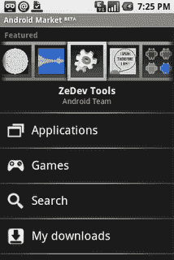

# Android 将获得自己的应用市场

> 原文：<https://web.archive.org/web/https://techcrunch.com/2008/08/28/android-to-get-its-own-app-market/>

# Android 将获得自己的应用市场

Android 博客报道称，谷歌已经正式宣布推出 Android Market，这是一个类似应用商店的解决方案，允许出版商上传程序并在线销售。

> 开发者将能够在谷歌托管的开放服务上提供他们的内容，该服务具有类似于 YouTube 的反馈和评级系统。我们选择术语“市场”而不是“商店”,因为我们觉得开发者应该有一个开放和无障碍的环境来提供他们的内容。与 YouTube 类似，内容可以在三个简单的步骤后在市场上首次亮相:注册为商家，上传和描述你的内容并发布。我们还打算为开发者提供一个有用的仪表板和分析，以帮助推动他们的业务，并最终改善他们的产品。

我们得到了更多关于[克朗彻齿轮](https://web.archive.org/web/20230320003255/http://www.crunchgear.com/tag/android)的信息。