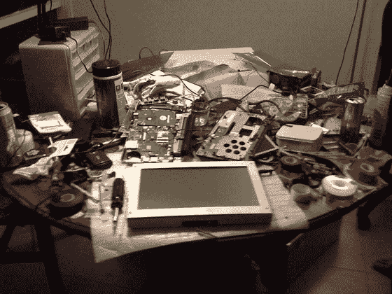

# TechCrunch 平板电脑更新:原型 A TechCrunch

> 原文：<https://web.archive.org/web/https://techcrunch.com/2008/08/30/update-on-the-techcrunch-tablet-prototype-a/>

# TechCrunch 平板电脑的更新:原型 A

TechCrunch 平板电脑的更新:一个不起眼的(也是混乱的)开始。原型 A 已经建成。它装在一个临时的铝制箱子里，这个箱子是当地一家钣金商店为我们组装的，厚度至少是所需厚度的两倍，但硬件已经确定，即将锁定。我们今天第一次在箱子里启动了机器，接入了 Wifi 网络，并能够通过触摸屏浏览网页。

大部分工作正在过渡到软件和用户界面，真正的工业设计工作才刚刚开始。

我们离测试版还很远，但是现在有一个团队正在为这个项目工作，一群令人难以置信的人和公司已经向我们伸出了援助之手。在过去的几周里，我们已经了解了很多关于构建硬件设备的知识，很明显，在我们预期的价格范围内，构建一个高性能的网络平板电脑是完全可能的。

一张有趣的图片:

