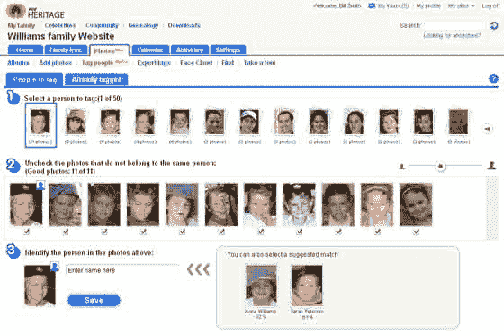
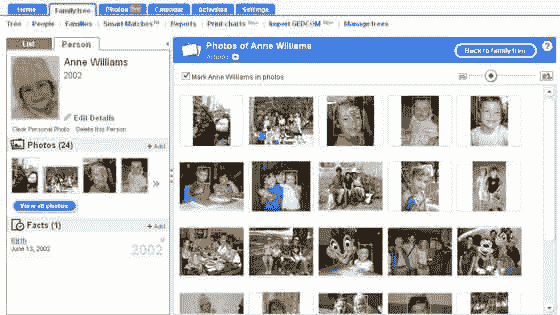

# 家谱大战仍在继续:MyHeritage 募集了大量资金，显示出令人印象深刻的增长

> 原文：<https://web.archive.org/web/https://techcrunch.com/2008/09/06/family-tree-wars-continue-myheritage-raises-big-round-shows-impressive-growth/>

# 家谱大战继续:MyHeritage 大幅增长，显示出惊人的增长

  就在几天前，我们发布了 [Geni 的大幅增长数据](https://web.archive.org/web/20230404173213/https://techcrunch.com/2008/09/03/genis-quest-toward-one-world-family-tree/)——现在是来自以色列竞争对手 [MyHeritage](https://web.archive.org/web/20230404173213/http://www.myheritage.com/) 的重大消息。

他们说，这个网站已经从一年前的 1 . 8 亿个人资料增长到今天的 2 . 6 亿。注册用户也从 1700 万增长到 2500 万。相比之下，Geni 有近 200 万用户。2.3 亿张照片被上传到该网站，该网站有 25 种语言版本，每月有 500 万独立访客。本月将发布对另外十种语言的支持。

投资者肯定注意到了 MyHeritage 的强劲增长。该公司已经筹集了新一轮资金——由 Index Ventures 牵头的 D 轮融资 1500 万美元，目前的投资者 Accel Partners 也加入了进来。这使得他们的总资本增加到了 2400 万美元。

**新功能——识别那些面孔**

MyHeritage 的面部识别功能有点像[最近的 Picasa 增强功能](https://web.archive.org/web/20230404173213/https://techcrunch.com/2008/09/02/picasa-refresh-brings-facial-recognition/)，可以让你通过标记个人的几张照片来训练这项服务。然后，MyHeritage 也开始自动标记你上传的其他照片。用户也不必直接上传照片。他们可以从 Picasa、Flickr、脸书等网站同步。一旦照片被正确标记上人名，MyHeritage 就会将它们重新同步回原始服务。

重申一下，MyHeritage 已经开发了一个很棒的工具，可以让用户在他们已经使用的服务上用人们的名字自动标记照片。

