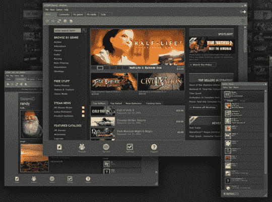

# 谷歌将收购 Valve？TechCrunch

> 原文：<https://web.archive.org/web/https://techcrunch.com/2008/09/17/google-to-acquire-valve/>

***更新**:阀说传言是[不实](https://web.archive.org/web/20221006004220/http://multiplayerblog.mtv.com/2008/09/17/valve-on-rumors-of-google-buy-out/)。*

《问询者报》今天上午报道称，谷歌即将以未披露的价格收购 Valve。据《问询报》报道，其“消息灵通人士”称，收购可能“随时”发生。

除了开发像《半条命 2》和《传送门》这样的游戏， [Valve](https://web.archive.org/web/20221006004220/http://www.valvesoftware.com/) 还是 Source 游戏引擎和 Steam 的开发者，Steam 是一个用于交付和管理数字内容的宽带平台。谷歌可能更关注 Steam(而不是公司的其他方面)。

乍一看，谷歌收购 Valve 似乎有点非正统。但考虑到 Steam 是市场上最好的游戏分发平台，也许谷歌正试图巩固其在该领域的地位，并从其舒适区扩展开来。

Steam 是如此易于使用，对许多人来说是如此理想的平台，以至于它目前为超过 1500 万下载超过 440 款游戏的活跃用户提供服务——这在市场上是无与伦比的壮举，对谷歌这样的公司来说价值不菲。

但问题仍然存在:谷歌，一个服务提供商和内容分发公司，真的想通过 Steam 分发内容吗？更重要的是，瓣膜收购合适吗？

很难说。表面上，谷歌希望收购 Valve，以控制数字发行业务，这将开创一个无需物理介质就可以直接将游戏下载到游戏机的时代，该公司甚至可以将其作为一种新的软件发行方式。通过拥有一些迄今为止最著名的游戏，谷歌也可以在游戏业务中建立一个立足点。

最终，谷歌是否收购 Valve 将取决于它将自己扩展到一个新市场的愿望。从表面上看，这似乎是一个明智之举。