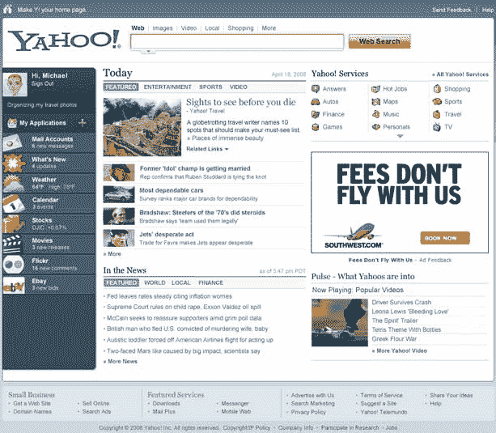
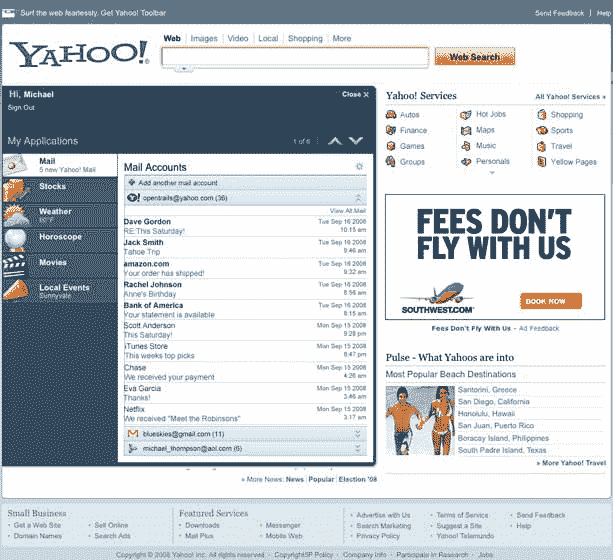
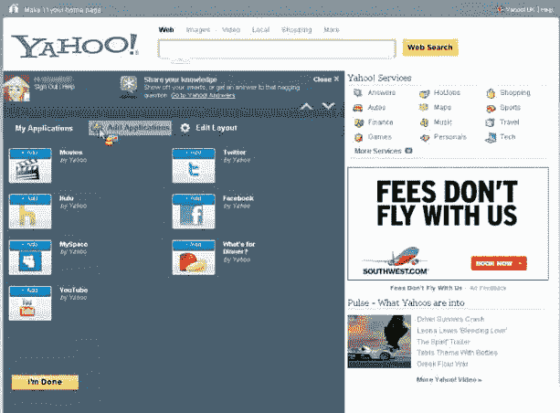

# 雅虎全新主页新旧结合技术危机

> 原文：<https://web.archive.org/web/http://techcrunch.com/2008/09/17/yahoos-all-new-home-page-a-mix-of-old-and-new/>

[雅虎](https://web.archive.org/web/20230203003321/http://www.yahoo.com/)将于今晚开始对一小部分用户进行新版主页测试。该公司上一次重新设计主页是在一年多前，今年早些时候，雅虎开始通过其新的 [Buzz 产品](https://web.archive.org/web/20230203003321/http://techcrunch.com/2008/02/25/yahoo-buzz-launches-with-massive-homepage-traffic-to-push-it/)将第三方内容整合到该网站上。

对该页面的任何改变都会在互联网上广泛传播——全世界每个月都有 3.14 亿人访问雅虎主页(2008 年 7 月，康姆斯克)。每天有 8200 万人访问它。

新页面结合了雅虎所谓的“广播”元素(对每个人来说都是相同的新闻和资源链接)和“窄播”，这是高度定制的主页，受到了我的雅虎、iGoogle、Netvibes 和其他公司的欢迎。

一个重要的补充是引入第三方服务到雅虎主页。目前，用户可以登录他们的 Gmail 或 AOL Mail 账户，直接查看来自 Yahoo.com 的电子邮件。这与美国在线上周发布的内容相似。和美国在线一样，雅虎选择将微软排除在派对之外。

今晚发布的其他变化在很大程度上是表面的。但雅虎计划逐步推出新功能，为网站带来更多第三方内容。

该产品将于今晚开始在美国、英国、印度和法国的少数用户中推广。

**即将到来的变化**

在今天的简报中，雅虎还展示了一些即将推出的功能，随着时间的推移，这些功能可能会整合到主页中。在这一点上，这些只是原型，但它们显示出将更多定制选项和第三方内容带入网站的倾向。

第一个是在主页上整合来自第三方来源的新闻条目。今天，“新闻”部分的所有新闻来源都指向雅虎内部新闻页面。但是内部原型显示了到外部资源的链接，如圣何塞水星新闻和旧金山纪事报。每当这个发布的时候，寻找媒体的大规模拍马屁，让他们在主页上。

我还看到了即将发布的“添加应用程序”功能，该功能允许用户将应用程序添加到左侧栏。该模型包括 Hulu、MySpace、YouTube、Twitter 和脸书的小部件——都是第三方服务。屏幕截图:

