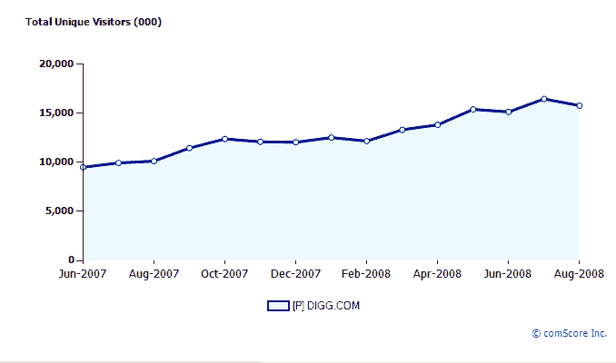

# 被谷歌抛弃后，Digg 向风投寻求 2900 万美元的 C 轮融资

> 原文：<https://web.archive.org/web/https://techcrunch.com/2008/09/24/spurned-by-google-digg-taps-vcs-for-29-million-c-round/>

# 被谷歌拒绝后，Digg 向风投寻求 2900 万美元的 C 轮融资

在被谷歌以 2 亿美元收购的[拒绝后，社交新闻网站 Digg 独自一人获得了新的](https://web.archive.org/web/20230403075536/https://techcrunch.com/2008/07/26/google-walks-away-from-digg-deal/)[2870 万美元的注资](https://web.archive.org/web/20230403075536/http://biz.yahoo.com/bw/080924/20080924005945.html)。C 轮融资由新投资者高地资本合伙公司(Highland Capital Partners)牵头，现有投资者格雷洛克合伙公司(Greylock Partners)、奥米迪亚网络公司(Omidyar Network)和 SVB 资本公司也参与了融资。这使得该公司自四年前成立以来筹集的资金总额达到了 4000 万美元。创始人凯文·罗斯可能拿走了一些现金。

该公司对新资金有着宏大的计划。在接下来的一年左右的时间里，它将把目前的员工增加一倍，达到 150 人，搬到一个新的公司总部，为国际市场本地化 Digg 网站，为出版商提供更好的分析，并在营销上投入更多。毫无疑问，Digg 也将努力通过向每个会员提供更好、更有针对性的推荐来改善服务。(在这方面，与脸书即将启动的合作应该会很有意思)。

Digg 声称每月有 3000 万独立用户。然而，据 ComScore 统计，截至 8 月份，全球有 1，580 万个 uniques，美国有 600 万个，均较 7 月份有所下降。( [Quantcast 显示](https://web.archive.org/web/20230403075536/http://www.quantcast.com/digg.com)全球独播 2140 万，美国 1140 万)。至少在美国，Digg 的流量似乎在变平。所以你可以看到为什么该公司要强调全球扩张。这是它在美国的交通图表:

这是一张全球交通图:

