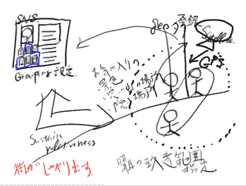

# 我们 Dash GPS 比赛的冠军是。。。TechCrunch

> 原文：<https://web.archive.org/web/https://techcrunch.com/2008/10/01/and-the-winner-of-our-dash-gps-contest-is/>

上周，我(与 Dash 和 Trulia 一起)宣布，我们将[向任何能为 Dash GPS](https://web.archive.org/web/20230328120409/https://techcrunch.com/2008/09/25/contest-were-giving-away-a-dash-gps-just-come-up-with-an-app-to-make-it-better/) 汽车导航设备开发出最佳新应用的人赠送该设备。读者提出了 300 多条建议，包括左边的[草图](https://web.archive.org/web/20230328120409/https://techcrunch.com/2008/09/25/contest-were-giving-away-a-dash-gps-just-come-up-with-an-app-to-make-it-better/all-comments/#comment-2481848)(我不知道它应该是什么)。但是很多想法都很可靠。

它们包括像[日历集成](https://web.archive.org/web/20230328120409/https://techcrunch.com/2008/09/25/contest-were-giving-away-a-dash-gps-just-come-up-with-an-app-to-make-it-better/all-comments/#comment-2481625)、[乘车共享应用](https://web.archive.org/web/20230328120409/https://techcrunch.com/2008/09/25/contest-were-giving-away-a-dash-gps-just-come-up-with-an-app-to-make-it-better/all-comments/#comment-2481426)、一个 [OpenTable 混搭](https://web.archive.org/web/20230328120409/https://techcrunch.com/2008/09/25/contest-were-giving-away-a-dash-gps-just-come-up-with-an-app-to-make-it-better/all-comments/#comment-2481457)和一些有趣的[基于位置的游戏](https://web.archive.org/web/20230328120409/https://techcrunch.com/2008/09/25/contest-were-giving-away-a-dash-gps-just-come-up-with-an-app-to-make-it-better/all-comments/#comment-2482599)。

但是 Dash GPS 归 Alfred Toh 所有，他发明了 [ParkSpot](https://web.archive.org/web/20230328120409/https://techcrunch.com/2008/09/25/contest-were-giving-away-a-dash-gps-just-come-up-with-an-app-to-make-it-better/#comment-2481302) :

> *park spot——一个实时社交停车工具。*
> 
> 基本上，dash 车主会帮助其他 dash 车主在繁忙的城市街道上找到停车位。当一个 dash 车主准备离开时，将您的 ParkSpot 状态设置为 ready to leave，这将向附近设置为 finding spots 的 dash 车主广播您的位置。

另一个很棒的想法，是一些人偶然想到的，围绕着[位置注释](https://web.archive.org/web/20230328120409/https://techcrunch.com/2008/09/25/contest-were-giving-away-a-dash-gps-just-come-up-with-an-app-to-make-it-better/all-comments/#comment-2481580)或[地理书签](https://web.archive.org/web/20230328120409/https://techcrunch.com/2008/09/25/contest-were-giving-away-a-dash-gps-just-come-up-with-an-app-to-make-it-better/all-comments/#comment-2481697)，但是最棒的人是罗布·格拉夫，他想出了[垃圾](https://web.archive.org/web/20230328120409/https://techcrunch.com/2008/09/25/contest-were-giving-away-a-dash-gps-just-come-up-with-an-app-to-make-it-better/all-comments/#comment-2482193):

> *Muck——“一个基于位置的 twitter 类应用程序”
> 你写一条 200 个字符左右的消息，然后被地理标记并发送到数据库。当其他人开车经过你写信息的地方时，他们通过他们的仪表板在读你的信息。像“这是镇上最长的红灯”或者“每天早上这个街角都有一个长相滑稽的流浪汉”这样的事情浮现在脑海里。*

罗柏会得到一件 TechCrunch T 恤。第二名也获得了一件 t 恤，是 JW，他想出了:

> ** [广告支持的过路费](https://web.archive.org/web/20230328120409/https://techcrunch.com/2008/09/25/contest-were-giving-away-a-dash-gps-just-come-up-with-an-app-to-make-it-better/all-comments/#comment-2482596)*
> GPS 知道你何时通过过路费，并可以显示多少地理定位广告会抵消过路费。这可以和一个 E-Z 通行证账户联系起来，这样收费站就不用做任何改动了。*

**优秀奖**(抱歉，没有奖品):

塞思·麦克吉尼斯:

> *车库拍卖搜索和邻近定位器。*

蒂姆·贝克:

> 我的应用程序将是一个购物工具。你输入你想买的商品，它会在地图上显示出售该商品的零售商和价格。你可以找到最短的距离，以最低的价格得到产品。

[凯斯特·吴](https://web.archive.org/web/20230328120409/https://techcrunch.com/2008/09/25/contest-were-giving-away-a-dash-gps-just-come-up-with-an-app-to-make-it-better/all-comments/#comment-2481487):

> *Blabba。*
> 
> 向你泄密的应用程序；呃，阅读(电子邮件，RSS 源等。)给你，这样你们这些疯狂的司机(包括我在内)就可以在开车的时候停止摆弄你们的 iPhones 和黑莓手机了。

约翰·惠特尼:

> *导游！*
> 
> 你在一个新的城市，或者你的家乡。你下载了一个游览，也许是关于一个特定的主题，比如建筑历史。你开着车跟着游览，它会告诉你一些关于你所在地方的有趣的事情。它告诉你停车，然后你可以读更多的书，也许出去找些有趣的东西。这件事的酷之处在于，旅游可以涉及许多主题。我很想在导游的带领下游览我的家乡斯克内克塔迪——这里有很多隐藏的历史。

[JSL:](https://web.archive.org/web/20230328120409/https://techcrunch.com/2008/09/25/contest-were-giving-away-a-dash-gps-just-come-up-with-an-app-to-make-it-better/all-comments/#comment-2481645)

> 代客监视器——它记录他们把你的车开了多远！(想想 Ferris Bueller)你输入一个 PIN 码，这个设备不会关闭，直到你禁用它。我认为，总的来说，Ferris Bueller 汽车场景将是 Dash 的一个很好的营销广告。

[IdeaTagger:](https://web.archive.org/web/20230328120409/https://techcrunch.com/2008/09/25/contest-were-giving-away-a-dash-gps-just-come-up-with-an-app-to-make-it-better/all-comments/#comment-2482042)

> *P2P 包裹递送:一种点对点的包裹递送服务，将想要发送包裹的人与他们所在地区将要前往包裹目的地的人带到一起。破折号可用于跟踪目的。*