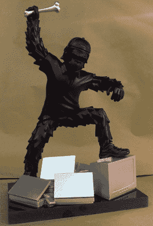

# 克朗彻:这不仅仅是一个奖项，更是一种武器

> 原文：<https://web.archive.org/web/https://techcrunch.com/2008/10/04/the-crunchie-its-not-just-an-award-its-a-weapon/>

# 嘎吱嘎吱声:这不仅仅是一种奖励，更是一种武器

去年，当我们委托制作嘎吱嘎吱奖的小雕像时，我们希望创造出比典型的塑料墓碑更令人难忘的东西。我们选择了一只塑料猴子举着一根骨头。虽然它确实有一定的威胁性，但我们从没想过有人会把它变成武器。

但是现在你可以在网络游戏[决斗](https://web.archive.org/web/20221003191613/http://www.duels.com/)中找到[《嘎吱嘎吱》](https://web.archive.org/web/20221003191613/http://www.duels.com/items/view/2221)。我们的奖励被重新设计成一把额定功率为 631 的致命狼牙棒(这是巨大的，一把普通的狼牙棒额定功率为 50 或更低)。似乎只有一个，由一个名叫洛基的玩家拥有(又名[安德鲁·布西](https://web.archive.org/web/20221003191613/http://www.crunchbase.com/person/andrew-busey)，挑战游戏的首席执行官，决斗的制造商)。你不会想惹他的。他有一个松脆饼干。

这是克朗彻在决斗武器页面上的描述:

> 这种风格化的权杖是为了捕捉历史的快照而制作的。工具的兴起，以及随之而来的生产力和暴力的迅速升级，预示着一个新时代的到来。成为文明的基础，工具很快成为武器。这个权杖记录了转型带来的对统治地位的追求。野蛮人使用的简单骨制武器体现了激烈的竞争和一场巅峰之战。今天的竞争可能更加文明，但仍然可能是残酷的。

这种情绪听起来很熟悉。以下是我们对为什么选择原始设计获奖的描述:

 *灵感来源于 [2001:太空漫游](https://web.archive.org/web/20221003191613/http://www.imdb.com/title/tt0062622/)。在电影中，一个史前猿人部落与出现在他们附近的一块黑色巨石互动。这块巨石激发了他们中的一个人创造了技术的第一次使用——将骨头用作工具和武器。该片段的[视频剪辑](https://web.archive.org/web/20221003191613/http://www.beta.techcrunch.com/2008/01/15/crunchies-the-award/)在我们关于该奖项的原始帖子中。*

我们表彰在技术上创新的创业公司；因此，我们认为这个奖项在文化上是有象征意义的，也是恰当的。额外的装饰，如棒球帽和运动衫，是艺术家使背景现代化的想法。猿猴正在用它的骨头敲打旧技术——这是技术世界破坏性的象征，在这个世界里，年轻的初创公司经常享用他们年长、缓慢的兄弟姐妹。

请继续关注明年嘎吱嘎吱奖的详情。

