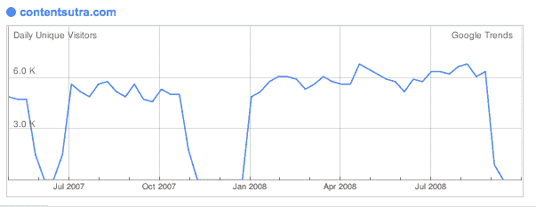

# 内容经的恶业。网站在被《卫报》收购后陷入混乱。TechCrunch

> 原文：<https://web.archive.org/web/https://techcrunch.com/2008/10/05/bad-karma-at-contentsutra-site-sputters-after-being-bought-by-the-guardian/>

# 内容经的恶业。网站在被《卫报》收购后陷入混乱。

据报道，英国报纸出版商卫报集团以 3000 万美元收购 Rafat Ali 的 ContentNext Media 和他的博客收藏仅三个月后，其中一个博客就出现了严重问题。该博客名为 [contentSutra](https://web.archive.org/web/20221007163432/http://www.contentsutra.com/) ，是其更大更知名的兄弟 [paidContent](https://web.archive.org/web/20221007163432/http://www.paidcontent.org/) 的印度翻版(两者都涉及数字媒体业务)。直到最近，contentSutra 还是 ContentNext 的第二大博客，甚至击败了 mocoNews。

但是如果你看看现在，交通已经从悬崖上跌落下来。帖子是零星的，大部分由新闻综述或 paidContent 的编辑偶尔发布的帖子组成。ContentNext 和《卫报》目前正在与印度的媒体公司就可能的联合和交叉推广交易进行谈判。有传言称，ContentNext 一直在与 HT Media(《印度斯坦时报》的出版商)、 [9.9 Media、](https://web.archive.org/web/20221007163432/http://www.9dot9.in/)等进行谈判。我们还收到了一个未经证实的消息，说《卫报》正试图卸载 contentSutra，但是拉法特·阿里说这不是真的。

无论如何，这个网站已经不如以前做得好了。建立了 contentSutra 两年的编辑 Nikhil Pahwa 于 5 月底离职，并于一个月后的 6 月 27 日推出了自己的竞争博客 [Medianama](https://web.archive.org/web/20221007163432/http://www.medianama.com/) 。Pahwa 在 ContentNext 中没有任何股权，并且对缺乏将其提升到下一个级别的计划感到沮丧。卫报的交易是在他推出 Medianama 两周后宣布的。帕瓦告诉我:

> 关于《卫报》的交易:我和其他人一样，在交易宣布的当天就知道了。在此之前，我只知道 ContentNext 正在筹集新一轮风险投资。从 contentSutra 在某个时间点的流量方面在 ContentNext 资产中排名第二的事实来看，对市场的兴趣是显而易见的。

这笔交易的原因之一(但显然不是主要驱动力)是 contentSutra 将提供的国际曝光度。在接受 paidContent 采访时，卫报媒体集团首席执行官卡罗琳·麦考尔解释了 ContentNext 印度媒体资产的吸引力:

> ***国际计划**:英国、美国和印度公司的共同利益是 fit 的主要部分。麦考尔:“我认为，印度是一个新兴市场，发展得非常好，那里有巨大的机会……我认为我们可以在印度互相帮助，因为我们长期以来一直在努力寻找这个市场。”*

帕瓦离开后，阿里开始[为 contentSutra 寻找新的编辑](https://web.archive.org/web/20221007163432/http://www.contentsutra.com/entry/419-job-with-us-editor-reporters-for-contentsutra)。他还在找。与此同时，Medianama 在印度数字媒体领域每天发布的帖子比 contentSutra 还多(也更好)。博客的好坏取决于它的作者。

这就是博客的特点。从劳动的角度来看，他们的效率令人难以置信。你可以用一个编辑器启动一个覆盖整个次大陆的媒体属性。另一方面，当你围绕一个人建立一个品牌或子品牌时，当这个人离开时，这个品牌就会受到打击。(这是所有博客都必须面对的问题，也是为什么给作者和编辑股权是个好主意)。