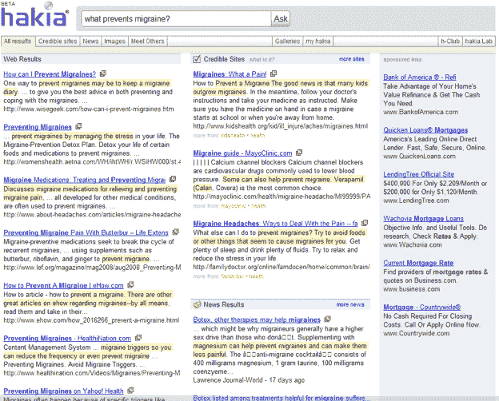
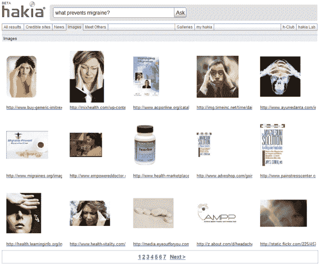

# 语义搜索引擎 Hakia 现在表示，它可以根据结果的可信度来过滤结果

> 原文：<https://web.archive.org/web/https://techcrunch.com/2008/10/06/semantic-search-engine-hakia-now-says-it-can-filter-results-by-how-credible-they-are/>

# 语义搜索引擎 Hakia 现在表示，它可以根据结果的可信度来过滤结果

在互联网上，没人知道你的网站是一只狗(套用著名的*纽约客*T2【漫画】T3)。至少现在还没有。语义搜索引擎 [Hakia](https://web.archive.org/web/20221006021622/http://www.hakia.com/) 想要改变这种状况。今天，Ask.com 并不是唯一一个推出重新设计的搜索引擎。Hakia 也是如此，它在搜索界面中引入了标签。其中一个标签是“可信网站”这些是经过图书管理员和信息专家审核的网站的结果(尽管任何人都可以建议网站)。到目前为止，Hakia 已经围绕健康、医疗和环境问题建立了一个可信网站目录。

“可信”的结果往往来自政府、大学、医学和新闻网站。例如，以下是[、](https://web.archive.org/web/20221006021622/http://credible.hakia.com/search.aspx?q=green+buildings)、[、【普通感冒】的可信结果](https://web.archive.org/web/20221006021622/http://credible.hakia.com/search.aspx?q=common+cold)

这个想法是，如果你的网站是一只狗，它就不会出现在名单上。虽然这种白名单方法可以提高结果的质量，但它似乎也太容易被利用了。任何垃圾邮件发送者都可以试图让他们的网站上真实和权威的名单。他们会的。

Hakia 的重新设计还包括一些其他新标签。即“新闻”、“图像”和“遇见他人”(不，这第三个不是语义约会服务。它是一个社交功能，让您可以加入与您正在搜索的主题相同的群组和论坛。结果都是基于每个领域内的语义匹配。(见下面截图)。但我不确定它们比谷歌的好多少。例如，这是 Hakia 的图片搜索结果[“全球变暖”](https://web.archive.org/web/20221006021622/http://images.hakia.com/search.aspx?q=global+warming)。现在在[谷歌图片搜索](https://web.archive.org/web/20221006021622/http://images.google.com/)上尝试同样的搜索。在这两种情况下，结果都不尽人意。

