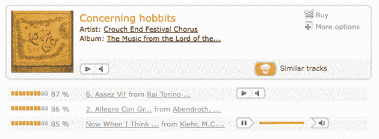

# Mufin:一个自动音乐推荐引擎

> 原文：<https://web.archive.org/web/https://techcrunch.com/2008/10/08/mufin-an-automated-music-recommendation-engine-that-actually-works/>

每当我们被介绍到一个以某种“数字指纹技术”为特色、为音乐推荐引擎提供动力的网站时，很难不持怀疑态度。指纹识别非常适用于在多个地方识别同一首歌曲，例如，音乐库中的重复歌曲。但是当涉及到音乐推荐时，自动化系统很少能很好地工作，这就是为什么 Pandora 依赖于 50+分析师团队来驱动其推荐引擎，而大多数其他网站依赖于社交建议和元数据。

今天见证了 [Mufin](https://web.archive.org/web/20221206225714/http://www.mufin.com/) 的私人测试版发布，这是一个自动化的音乐推荐引擎，看起来真的很好用(而且它真的真的很酷)。技术是复杂的，但这并不令人惊讶地给出了穆芬的血统:该网站是德国研究机构弗劳恩霍夫研究所的分支，该机构最初创建了无处不在的 MP3 音频压缩算法。你可以点击这里获得私人测试版[的邀请。](https://web.archive.org/web/20221206225714/http://beta.mufin.com/start?ic=73c9965de675083353d85d4218b808e3)

在网站的 350 万首歌曲数据库中搜索他们最喜欢的一首歌曲后，用户可以按下“相似曲目”来查看由网站强大的算法确定包含相似特征的歌曲的简短列表。该算法分析每首歌曲的 40 个特征，包括速度、声音密度和各种其他因素。用户既可以在 Mufin 的主页上搜索歌曲，也可以通过嵌入的 MySpace 小工具(脸书即将推出)搜索歌曲。

在实践中，这些建议似乎非常有效——至少在我测试的 75%以上的时间里。我搜索很多流行歌曲(比如《太阳来了》)得到的结果听起来非常相似，尽管很多匹配的歌曲使用的是不同的语言，或者是由不知名的乐队录制的。为了排除预先确定的匹配的可能性，我尝试了一些更模糊的记录。《黑暗》永恒的经典我相信一种叫做爱情的东西《T1》产生了欧洲的《T2》吸盘《T3》。坂本圭的“[寿喜烧](https://web.archive.org/web/20221206225714/http://www.youtube.com/watch?v=RtXQ31F1A-k)”与唱片中的“[暮光之城](https://web.archive.org/web/20221206225714/http://www.youtube.com/watch?v=zpdaga8cCxU)”相匹配——这首歌我从未听说过，但无疑是相似的。**注意:我已经链接了上述歌曲的 YouTube 剪辑，所以你可以听到相似之处——似乎还没有嵌入 Mufin 结果的方法。**

不幸的是，虽然该网站背后的技术令人印象深刻，但仍需要相当多的工作。许多匹配似乎是准确的，但该网站没有解释为什么推荐某首歌曲。Mufin 说，它将包括类似 Pandora 的解释，详细说明每首歌之间哪些特征被认为是相似的，但现在你还一无所知。

该网站还有许多许可问题需要解决。Mufin 已经与环球音乐集团合作，但数据库中的许多歌曲缺乏预览剪辑，这使得一些比赛没有用，因为没有简单的方法来听它们。目录中的其他歌曲有试听，但没有 iTunes 或亚马逊等在线音乐商店的链接，所以没有合法购买的便捷方式。搜索结果充斥着“热门”专辑的复制品。

除了这些问题，Mufin 还有很多潜力，一旦它清理了界面并解决了许可问题，它可能会成为 Pandora 或 Last.fm 等网站的可行替代品。