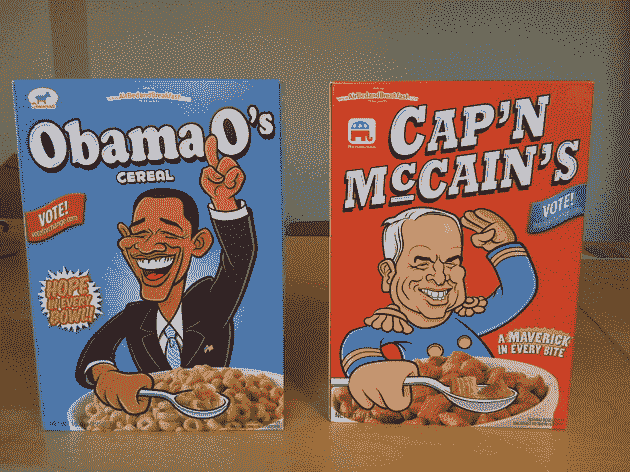

# 你家的早餐是什么:奥巴马的还是麦凯恩的？

> 原文：<https://web.archive.org/web/https://techcrunch.com/2008/10/09/whats-for-breakfast-at-your-house-obama-os-or-capn-mccains/?guccounter=1&guce_referrer=aHR0cHM6Ly93d3cuZ29vZ2xlLmNvbS8&guce_referrer_sig=AQAAAIT3DvrkVwglBEPkd63gqyQBrJ7Tn_AIv6vRjMDCmO8DZAR1pJKWnjv8pTYz31J478lwlvrvg8yBJlPWesqrWmtuqvfVLYsF-O8HHjHfXOJ0_yrSvobo4LmPJLj9p-I59zDBVs2pD2Xxv0aRZo9B4tMpjZXqWpZcISRPxr2LrGYk>

# 你家的早餐是什么:奥巴马的还是麦凯恩的？

本周与选举相关的最佳营销推广奖颁给了[充气床垫&早餐](https://web.archive.org/web/20230126102838/http://www.airbedandbreakfast.com/)，旅行者点对点[住宿网站](https://web.archive.org/web/20230126102838/http://techcrunch.com/2008/08/11/airbed-and-breakfast-takes-pad-crashing-to-a-whole-new-level/)。(你列出你希望旅客在你的楼层住一晚的价格，他们通过网站预订)。今天，我收到了一个来自空中早餐的包裹，里面有两盒麦片，如上图所示:奥巴马的和麦凯恩的。除了麦片的实体盒子，每种麦片都有两个朗朗上口的广告词(嵌入在下面)，还有一个[网页](https://web.archive.org/web/20230126102838/http://www.airbedandbreakfast.com/obamaos)，你可以在这里为你喜欢的麦片投票。

这和充气床垫和早餐有什么关系？为了推广这项服务，这家初创公司正在鼓励全国各地的人们为每一场竞选活动提供动员投票志愿者。主人可以点一盒他们喜欢的麦片，作为早餐。只不过每盒售价 39 美元，公司每盒只生产了 500 个。(如果他们生产更多，这可能是他们的商业模式，至少在一个月内是如此)。

我真的很喜欢这个设计。奥巴马 O's 盒子的正面印有“希望在每一个碗里”，背面称自己为“变革的早餐”。《麦凯恩船长》盒子上的麦凯恩角色恰如其分地穿着海军军官的制服，盒子的侧面唱出了对吃方块的赞美(盒子里面是重新包装的桂格泡芙；奥巴马 O 型真的是蜂蜜 O 型。麦凯恩船长盒子侧面的文字可能是他的竞选团队写的:

> 操作系统可能看起来很漂亮，但你有没有发现它少了些什么？没错，每个 o 的中间都有一个洞。麦凯恩船长的每一口都有一整片麦片。

它还指出，“广场是可以堆叠的”，“广场让美国保持规则。”但是奥巴马的歌曲更吸引人。听一听:

## 奥巴马的

 标准播客【20:28m】:[立即播放 ](#) | [弹出播放](#) | [下载](https://web.archive.org/web/20230126102838/https://techcrunch.com/wp-content/uploads/2008/10/obama_jingle.mp3)

## 麦凯恩上尉

 标准播客【20:28m】:[立即播放 ](#) | [弹出播放](#) | [下载](https://web.archive.org/web/20230126102838/https://techcrunch.com/wp-content/uploads/2008/10/mccain_jingle.mp3)

