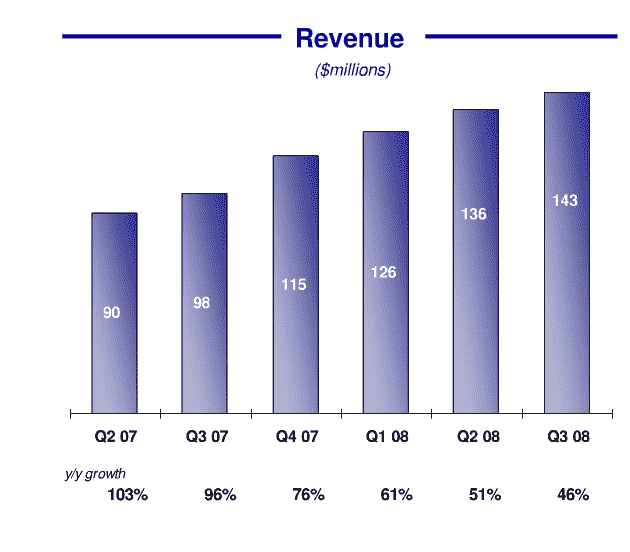
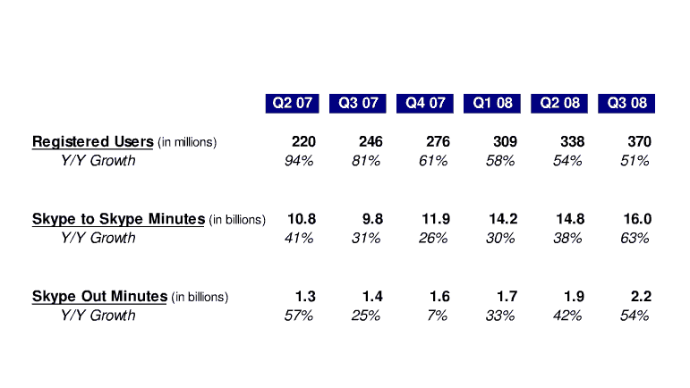

# 随着易贝核心业务陷入困境，Skype 开始大放异彩

> 原文：<https://web.archive.org/web/https://techcrunch.com/2008/10/15/as-ebays-core-business-hits-hard-times-skype-begins-to-shine/>

# 随着易贝核心业务遭遇困难，Skype 开始大放异彩

尽管易贝今天超过了向下修正的收益数据,但其收益电话会议充满了令投资者沮丧的消息。(下面嵌入了完整的收益幻灯片)。在连续三个季度持平后，收入较第二季度下降 3.6%，至 22 亿美元。在过去的四个季度中，自由现金流一直在下降，通过拍卖和电子商务网站交易的商品总价值也在下降。如今，易贝更倾向于由商家主导的类别，如汽车，而不是普通人之间的拍卖。

就连 PayPal 本季度的收入也持平，为 5.97 亿美元。也许稍后以 9 . 45 亿美元收购比尔·梅将有助于重振增长。其分类广告业务(Kijiji)带来了可观的 2.5 亿美元收入。

令人惊讶的是，另一家易贝公司是 Skype。第三季度的收入为 1.43 亿美元。尽管其增长率正在放缓，但至少在年度(46%)和季度(5%)的基础上，它仍在增长。它的总注册用户增长了 51%，达到 3.7 亿，这些人用掉了 160 亿分钟的通话时间。

与前几个季度相比，这几分钟的年增长率(63%)实际上在加快。最重要的是，人们实际付费的分钟数(22 亿 Skype Out 分钟)也在加速增长(54%)。

不幸的是，Skype 仅占易贝总收入的 10 %,仍然太小，不足以抵消其整体下滑。说不定他们还能[卖](https://web.archive.org/web/20221204181301/http://www.beta.techcrunch.com/2008/04/18/ebay-will-sell-skype-report/)。

