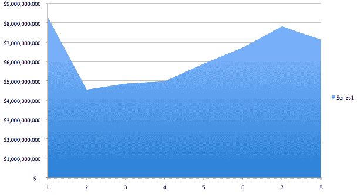
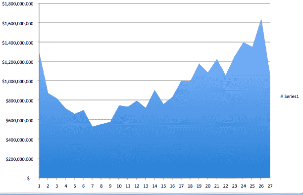
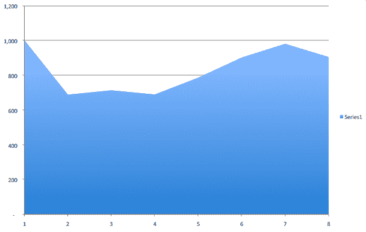
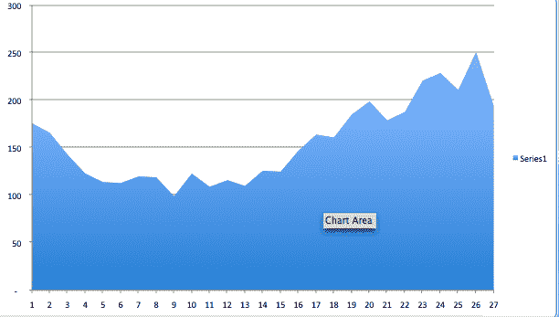
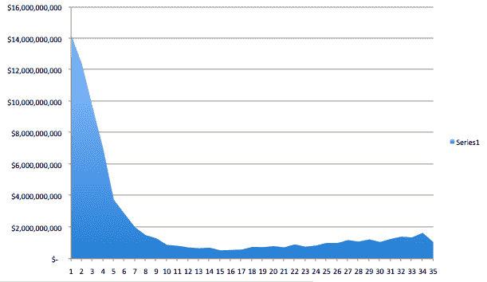
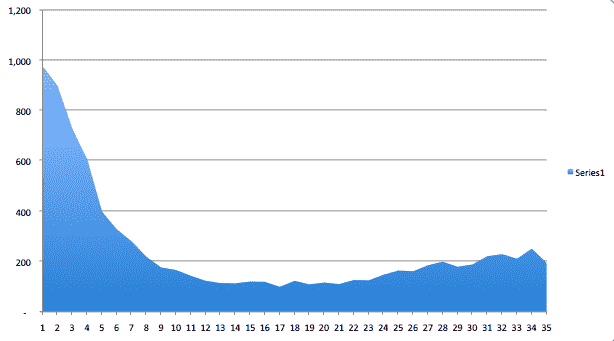

# 第三季度互联网创业公司的风险投资下降 16% TechCrunch

> 原文：<https://web.archive.org/web/https://techcrunch.com/2008/10/18/vc-financings-for-internet-startups-down-16-percent-in-third-quarter/>

# 第三季度互联网创业公司的风险投资下降了 16%

普华永道和国家风险投资协会的 MoneyTree 报告今天早上发布。它显示，与去年同期相比，第三季度的风险投资融资总额下降了 7%，至 71 亿美元。这也比 T2 第二季度下降了大约相同的数量。在上图中，我绘制了自 2001 年以来每个第三季度风险投资的美元价值，当时有 83 亿美元投资于风险投资支持的初创公司。虽然 71 亿美元仍然是一个健康的数额，但你可以看到这可能是融资活动显著下降的第一个季度。

**更新**:这是一个交互式的 [iChart](https://web.archive.org/web/20221002002647/http://www.icharts.net/portal//app?service=external&page=Chartdetail&sp=Y3jUyCw=) ，上面的数据也是一样的(将鼠标放在每个条形上可以了解更多信息，使用底部的滑块可以改变时间范围):

[http://widget.icharts.net](https://web.archive.org/web/20221002002647/http://widget.icharts.net/)

如果你关注互联网交易，风投资金下降了 16%，至 10 亿美元。下面是一张图表，描绘了自 2002 年第一季度以来互联网交易的连续金额，当时投资额为 13 亿美元。(很抱歉这张图和第一张图之间的对比，第一张图只显示了每年第三季度的数据。下面嵌入了包含所有这些数据以及追溯到 1995 年的更多数据的整个电子表格)。

**更新**:这是一张 [iChart](https://web.archive.org/web/20221002002647/http://www.icharts.net/portal//app?service=external&page=Chartdetail&sp=Y3jUyC0=) 图，显示了每三个季度进入互联网交易的风投资金，以及有多少进入了早期(“第一序列”)交易:

[http://widget.icharts.net](https://web.archive.org/web/20221002002647/http://widget.icharts.net/)

第三季度共有 907 笔风投支持的交易，相比之下，一年前为 983 笔，第二季度为 1033 笔(见下面的第一张图表，与上面的第一张图表同期)。第三季度互联网交易数量为 194 笔，而一年前为 221 笔，上一季度为 251 笔(见下面的第二张图表，与上面的第二张图表是同一时期):

**更新**:这是另一个 [iChart](https://web.archive.org/web/20221002002647/http://www.icharts.net/portal//app?service=external&page=Chartdetail&sp=Y3jUyCI=) 比较所有风投交易的数量和互联网交易的数量:

[http://widget.icharts.net](https://web.archive.org/web/20221002002647/http://widget.icharts.net/)

从某种角度来看，这里有两个图表显示了 2000 年第一季度的互联网交易，当时有 124 亿美元(第一个图表)投资于 900 笔交易(第二个图表)。

[http://viewer.docstoc.com/](https://web.archive.org/web/20221002002647/http://viewer.docstoc.com/)
[风投融资电子表格](https://web.archive.org/web/20221002002647/http://www.docstoc.com/docs/1963760/VC-Financings-Spreadsheet)–获取更多[商业计划](https://web.archive.org/web/20221002002647/http://www.docstoc.com/documents/business/)