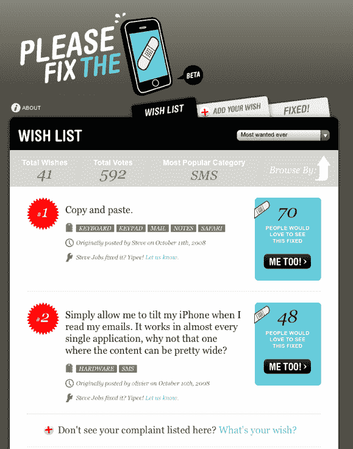

# 请修复 iPhone:史蒂夫·乔布斯的待办事项清单

> 原文：<https://web.archive.org/web/https://techcrunch.com/2008/10/20/please-fix-the-iphone-a-to-do-list-for-steve-jobs/>

# 请修复 iPhone:史蒂夫·乔布斯的待办事项清单

iPhone 上瘾者爱他们的 iPhone，但没有什么是完美的。苹果公司的客户反馈刚刚在[公开，请修复 iPhone](https://web.archive.org/web/20221024055425/http://pleasefixtheiphone.com/) 。该网站让 iPhone 用户或其他人列出并投票选出 iPhone 上最需要修复的功能。获得最多投票的特征排名上升。

目前最大的需求是:

1.复制并粘贴。
2。电子邮件的横向视图。
3。隐藏不想要的图标的能力。
4。将 iPhone 用作 MacBook
5 的 3G 调制解调器。让 Flash 发挥作用。

看起来史蒂夫·乔布斯有了一个新的任务清单。你想补充什么？别告诉我们，去网站上投票吧。

(该网站是在线营销公司 [Fullsix](https://web.archive.org/web/20221024055425/http://fullsix.com/index.php) 的一个附带项目)。

