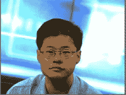

# 杨致远给所有雅虎人的电子邮件:你们中的 10%被解雇了

> 原文：<https://web.archive.org/web/https://techcrunch.com/2008/10/21/jerry-yang-email-to-all-yahooers/>

 美国太平洋标准时间下午 2 点 20 分，在[财报公布后](https://web.archive.org/web/20221006165650/http://www.beta.techcrunch.com/2008/10/21/yahoo-to-cut-headcount-at-least-10-percent-possibly-more-to-come-next-year/)，雅虎 CEO 杨致远向所有雅虎员工发送了以下邮件。除了全部小写，像往常一样，他让每个人都知道，公司将让 10%的员工去帮助节省 4 亿美元的年度成本。当然，杨致远不会被裁员。

完整电子邮件:

发自:杨致远[mailto:jerry@yahoo-inc.com]发送:2008 年 10 月 21 日星期二下午 2:20
到:all-worldwide@yahoo-inc.com
主题:更新

耶胡，

我觉得在我们公布收益之后，在我们明天全体会议之前，联系你是很重要的。

作为一家公司，我们经历了极具挑战性的一年；管理日益动荡的全球广告环境是过去三个月的一个重要焦点。

在 2008 年的前三个季度，我们一直在投资我们的首要任务和管理我们的成本结构之间进行平衡。从 9 月份开始，在 Bain & Co .的帮助下，我们启动了一系列措施，以确定如何提高组织的效率和生产力。

我们通过 YEES 调查听到了您的意见，以及您对后院的建议，我们已经确定了许多我们都认为可以改进的领域。我们的生产力工作，部分基于我们从您那里听到的，将涉及到诸如通过减少层级和增加控制范围来精简我们的组织结构，以及消除冗余等举措。长期结构效率包括整合设施、改善采购和标准化我们的全球技术平台。

今天，作为我们第三季度收益报告的一部分，我们说我们的目标是在 2008 年底前将目前约 39 亿美元的年化成本运行率降低 4 亿美元以上。我们尽可能将非员工开支作为目标，如设施和外部服务。然而，由于薪酬支出是我们成本中最大的一部分，我们预计到年底，我们的全球员工将至少减少 10%。

受影响的员工将在未来几周内收到裁员通知。我们知道现在听到这个消息会产生不确定性，但我们正在以一种平衡速度的方式前进，同时明确地专注于完成为组织的长期成功做准备所必需的事情。展望未来，对我们来说，做出正确的决策以保持我们的业务高效和强大仍然非常重要。

裁员是非常困难的，尤其是考虑到我们今年所经历的一切。但是我们不会轻易做出这些决定，我们致力于公平对待受影响的员工，提供解雇和再就业服务。

作为一家公司，我们正在采取的措施并不容易，但随着我们作为一个组织变得更加适应，决策将会更快，我们所有人都将更容易完成更多工作并专注于我们的战略。这些变化也将帮助我们更好地应对宏观经济下滑。与以往的低迷时期一样，雅虎。继续成为消费者寻求信息和通信的地方，并且是他们互联网生活不可或缺的一部分。随着全球经济在未来的改善，我当然相信我们会更强大，并从我们现在采取的行动中受益。

一如既往，我感谢你们作为雅虎所做的一切。

最好的，

偷工减料的