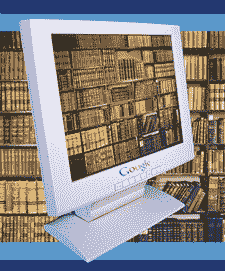

# 作者、出版商与谷歌就超过 1.25 亿美元的诉讼达成和解 TechCrunch

> 原文：<https://web.archive.org/web/https://techcrunch.com/2008/10/28/authors-and-publishers-associations-settle-with-google-over-125-million-lawsuit/>

# 作者、出版商与谷歌就超过 1.25 亿美元的诉讼达成和解

 [美国作家协会](https://web.archive.org/web/20221007104836/http://authorsguild.org/)和[美国出版商协会](https://web.archive.org/web/20221007104836/http://www.publishers.org/)，代表广泛的版权所有者，将于今天与谷歌联合举办一次电话会议，讨论[和解协议](https://web.archive.org/web/20221007104836/http://www.authorsguild.org/advocacy/articles/settlement-resources.html)，该协议将扩大在线访问美国数百万未版权保护的书籍和其他书面材料，这些书籍和材料来自参与谷歌图书搜索的美国主要图书馆的收藏。

这涉及到由作家协会提起的集体诉讼和由五家大出版商作为 AAP 会员代表提起的单独诉讼。2005 年 9 月，在谷歌与主要大学图书馆达成协议，扫描和复制他们收藏的数百万本图书后，该协会起诉了谷歌。

作家协会主席罗伊·布朗特写道:

> 该和解协议在生效前必须得到一名联邦法官的批准，它包括目前的资金和未来的资金前景。至少有 4500 万美元将支付给那些版权内书籍和其他版权文本未经许可被扫描的作者和出版商。如果你的书被扫描，并且你拥有所有的版权，你将得到一小部分，至少 60 美元，这取决于有多少版权持有者提出索赔。
> 
> 我们大多数人更感兴趣的是未来收入的前景，这也是我们提案中雄心勃勃的部分。根据和解协议，版权所有者将从通过谷歌图书搜索获得的图书收藏的机构订阅收入中，以及从在线消费者对图书的访问销售中获得一部分收入。他们还将为在公共图书馆的打印输出以及其他用途获得报酬。

该和解协议仍需得到美国纽约南区地方法院的批准。