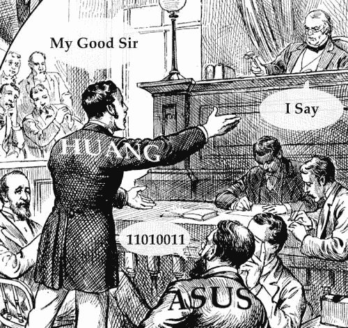

# 黄诉华硕:企业欺诈还是消费者贪婪？TechCrunch

> 原文：<https://web.archive.org/web/https://techcrunch.com/2008/11/02/huang-vs-asus-corporate-fraud-or-consumer-greed/>

# 黄诉华硕:企业欺诈还是消费者贪婪？

我在想 A 列的一点点，b 列的一点点。[故事是这样的](https://web.archive.org/web/20230316102515/http://www.danwei.org/front_page_of_the_day/jailed_for.php):中国的学生黄金买了一台华硕笔记本电脑，它有很多硬件问题。她送回来几次，最终他们更换了 CPU，然后开始过热。检查后，她发现这是一个“工程样品”——一个为测试目的而制造的早期运行的 CPU 一些不应该公开分发的东西。

她找了一名律师，要求华硕赔偿 500 万美元，否则她将向公众发布媒体。华硕与她进行了谈判，但最终断然拒绝了她，并指控她敲诈。她在监狱里呆了 10 个月，现在已经被释放，并正在反诉华硕，要求赔偿损失，州政府驳回了她的剩余刑期，称证据不足。好一个故事！猜测华硕这样的大公司的道德或道德缺失是没有用的，但我的猜测是，他们首先犯了将工程样品扔进垃圾堆以供重复使用的错误(啧啧啧)，然后对投诉人进行了过分热情的起诉。毕竟，他们肯定知道如果起诉她，信息会泄露出去，所以为什么要这么麻烦呢？

另一方面，当黄要求如此惊人的一笔钱来让她守口如瓶时，她一定知道她所做的是纯粹的敲诈。她现在试图警告人们，华硕试图欺骗人们，但企业的不公正不是特别罕见，我不认为她真的有资格批评。你们觉得怎么样？
【通过 [BoingBoing 小工具](https://web.archive.org/web/20230316102515/http://gadgets.boingboing.net/2008/10/31/asus-gets-customer-t.html)