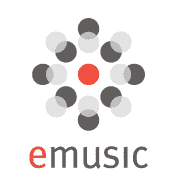

# eMusic:下载了 2.5 亿首歌曲。iTunes:50 亿 TechCrunch

> 原文：<https://web.archive.org/web/https://techcrunch.com/2008/11/20/emusic-250-million-songs-downloaded-itunes-5-billion/>

# eMusic:下载了 2.5 亿首歌曲。iTunes:50 亿以上

音乐订阅业务会超越目前的利基市场吗？看起来越来越可疑。今天，eMusic 宣布，自 2003 年推出当前的音乐订阅服务以来，客户已经下载了 2.5 亿首歌曲。相比之下，苹果的 iTunes 自 2003 年 4 月开设 iTunes 商店以来，已经卖出了超过 50 亿首歌曲。这使得 eMusic 的大小只有 iTunes 的二十分之一。

eMusic 的工作方式是，你每月支付 12 至 20 美元的订阅费，然后你可以每月下载 30 至 75 首歌曲并保存它们。你也可以购买超过这些限制的歌曲，起价为每首 0.25 美元。eMusic 拥有 450 万首歌曲的目录，在独立音乐方面尤其强大。它目前有 40 万用户，该公司预计今年的收入为 7000 万美元。

这意味着绝大多数用户选择每月 12 美元的基本计划，如果每个人都支付这一费用，每年将净得 5760 万美元。这种差异可以由那些选择更昂贵的土地和额外下载的人来解释。这项业务最好的一部分是，不管客户实际下载的歌曲有多少，eMusic 都能获得最低保证报酬~~只为客户下载的歌曲支付标签费用~~。因此，如果有人没有用完他们的配额，并且在某个月只下载了 5 首歌曲，eMusic ~~会把本来会给~~的钱装进口袋，而唱片公司会把他们本来可以下载的其他 25 首歌曲的钱装进口袋。纠正:唱片公司不是按每首歌曲付费的，而是收取 eMusic 总订阅和下载收入的 60%

这是一个很好的生意，因为 eMusic 因客户的懒惰而获得回报。iTunes 当然需要竞争，所以我希望它能继续发展。但这些数字对于订阅音乐业务以任何有意义的方式挑战 iTunes 来说都不是好兆头。