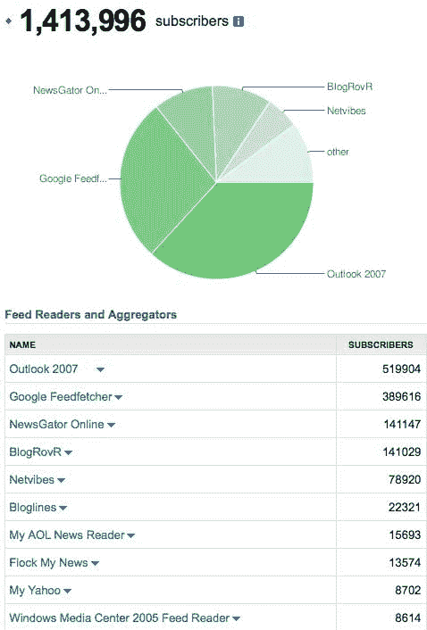

# TechCrunch Feed 阅读器崩溃——Outlook 主宰一切

> 原文：<https://web.archive.org/web/https://techcrunch.com/2008/11/20/techcrunch-feed-reader-breakdown/>

# TechCrunch Feed 阅读器崩溃——Outlook 主宰一切

我们偶尔会展示一些人们用来访问 TechCrunch 内容的 feed 阅读器的统计数据。由于我们最近通过了[百万每日 RSS 读者](https://web.archive.org/web/20230326063102/https://techcrunch.com/2008/09/13/1-million-rss-readers-thank-you-techcrunch-readers/)，现在是一个新的更新的好时机。

2006 年 6 月,火狐、博客和 Newsgator 依次成为三大阅读器。Feedburner 在 2006 年晚些时候做了一个类似的 T5 分析。很久以前，谷歌阅读器盖过了所有这些阅读器。最近，Outlook 已经成为订阅源阅读器的首选。

在我们大约 140 万名 RSS 读者中，有 52 万人(约 38%)来自 Outlook。39 万，约 28%，来自谷歌阅读器。Newsgator 和 BlogRovR 紧随其后，各占 10%左右，接下来是 Netvibes、Bloglines、AOL、Flock、Yahoo 和 Windows Media Center。

完整的细目如下。

