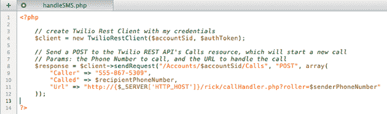

# Twilio:用于电话服务的强大 API，可以在 15 行代码中重建 GrandCentral 的核心功能

> 原文：<https://web.archive.org/web/https://techcrunch.com/2008/11/20/twilio-powerful-api-for-phone-services-that-can-recreate-grandcentral-in-15-lines-of-code/>

# Twilio:用于电话服务的强大 API，可以用 15 行代码重新创建 GrandCentral 的核心功能

每隔一段时间，我们都会遇到一家公司，它似乎有一个巨大的收购目标，有一个伟大的产品，可行的商业模式，和一个有才华的团队。 [Twilio](https://web.archive.org/web/20230320003300/http://www.twilio.com/) ，一家为各种电话服务开发了直观 API 的初创公司，就是这种类型的公司(它还成功地 [Rick Roll my boss](https://web.archive.org/web/20230320003300/https://techcrunch.com/2008/11/18/no-one-is-safe-from-the-rickroll-now/) )。这家初创公司开发了一种简单的 API，采用按需付费的定价方式，允许开发人员快速将电话服务纳入他们的应用程序，为许多服务打开了大门，这些服务以前只有一小部分在电话的黑暗魔法中受过训练的工程师才能使用。Twilio 今天将推出私人测试版，TechCrunch 的读者可以在这里获得邀请。

首席执行官杰夫·劳森说，虽然存在其他网络电话服务(如开源项目 [Asterisk](www.asterisk.org/) )，但这些技术往往非常复杂，难以使用，即使对有经验的开发人员来说也是如此。Lawson 说，Twilio 希望通过引入一套非常直观的命令，让开发者更容易使用这些电话服务，从而使这些服务商品化。该 API 主要由 5 个常用的电话动作组成(比如，播放、录音、拨号和收集电话号码)，每个动作的行为都完全符合您的预期。前几天我们听到的那个[瑞克罗尔 app](https://web.archive.org/web/20230320003300/https://techcrunch.com/2008/11/18/no-one-is-safe-from-the-rickroll-now/) ？下面是代码(对于非程序员来说，这是非常基本的东西):

劳森向我展示了许多其他令人印象深刻的例子，包括一个项目，他说该项目只用了大约 15 行代码就成功复制了 GrandCentral 的核心功能。许多组织已经开始使用 API 来构建自己的应用程序，包括一个非营利组织，该组织现在已经自动处理了数百个过去需要员工花费数小时才能完成的电话。

Twilio 采用云服务模式，不需要合同，根据使用的分钟数和需要的电话号码数量收取固定费用(开发者也可以根据需求扩展需求，因此他们不必担心服务器崩溃)。虽然 Rick Roll 应用程序是与该服务一起创建的，但 Lawson 表示，这只是一个发布前的玩笑，安全措施已经到位，以防止任何未来的应用程序发出烦人的电话。

Twilio 并不完美——它还不支持语音识别，而语音识别是许多电话服务的关键组件(尽管该功能将在未来版本中发布)。但是它非常酷，并且可能会在开发者中非常受欢迎。如果这个很快被像 Rackspace 或亚马逊这样的云服务提供商抢走，不要感到惊讶(我赌亚马逊——首席执行官杰夫·劳森曾是 AWS 的产品经理)。

还有一些其他创业公司试图让开发者更容易获得电话服务，包括 [Skydeck](https://web.archive.org/web/20230320003300/http://skydeck.com/) ，我们在这里[报道过](https://web.archive.org/web/20230320003300/https://techcrunch.com/2008/06/02/skydeck-goes-social-and-releases-apis-700-invites/)。