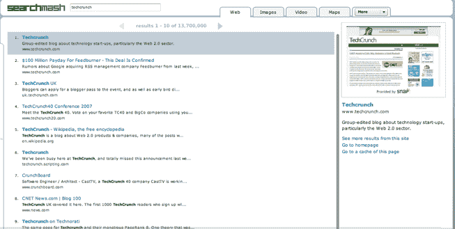

# 谷歌为什么停产 SearchMash？TechCrunch

> 原文：<https://web.archive.org/web/https://techcrunch.com/2008/11/24/why-did-google-discontinue-searchmash/>

# 谷歌为什么停产 SearchMash？

不管你是否喜欢 SearchWiki，谷歌[上周推出的搜索结果投票和评论新功能](https://web.archive.org/web/20230404193235/https://techcrunch.com/2008/11/20/google-makes-major-interface-change-to-search-searchwiki/)、[或](https://web.archive.org/web/20230404193235/https://techcrunch.com/2008/11/21/google-it-wasnt-broke/)、[而非](https://web.archive.org/web/20230404193235/https://techcrunch.com/2008/11/22/google-searchwiki-is-back-heres-how-to-kill-it-for-good/)，不可否认的是，该公司一次为所有拥有谷歌账户的人开放该功能，而不是逐步发布，这是一个大胆的举动。

诚然，他们已经对这一功能进行了一段时间的测试，但对谷歌来说，让用户在搜索时将呈现给他们的结果混合起来是一件大事。因此，当所有人都在关注 SearchWiki 及其对公司的意义时，Lively 旁边的 Google [也决定终止其搜索沙盒](https://web.archive.org/web/20230404193235/https://techcrunch.com/2008/11/19/google-kills-lively/) [SearchMash](https://web.archive.org/web/20230404193235/http://searchmash.com/) (它走了“恐龙之路”)，而不是用它来测试 SearchWiki，这有点令人惊讶。

SearchMash 是一个实验性的非品牌搜索引擎，谷歌过去可以用它来玩新的搜索技术、概念和界面。它于 2006 年 10 月首次推出，并在整整一年后向公众公开。有些人实际上用谷歌的搜索引擎换了 SearchMash，显然对这种体验很满意，现在看到它的消失很难过。

这项服务并不打算吸引大量用户，而是让谷歌尝试元搜索功能(网页、图像、视频和维基百科的结果混合在一起)、第三方集成(它使用 Snap 预览外部链接的登录页面)、用户界面实验(如“无限滚动”，允许你在同一页面上查看尽可能多的搜索结果)和技术(它有一个 Ajax 和 Flash / Flex 版本)。

谷歌没有把 SearchMash 作为试用 SearchWiki 功能的平台，这本身就有些奇怪，甚至更奇怪的是，他们决定在推出 search wiki 功能的同时悄悄扼杀它。

