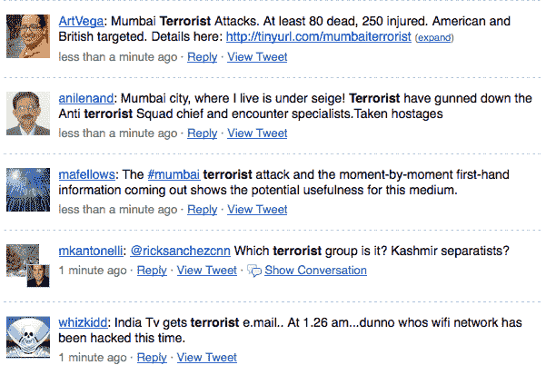

# Twitter、Flickr | TechCrunch 上关于印度恐怖袭击的第一手报道

> 原文：<https://web.archive.org/web/https://techcrunch.com/2008/11/26/first-hand-accounts-of-terrorist-attacks-in-india-on-twitter/>

# 在 Twitter，Flickr 上对印度恐怖袭击的第一手报道

忘记 [CNN](https://web.archive.org/web/20230326022301/http://www.cnn.com/2008/WORLD/asiapcf/11/26/india.attacks/index.html) ，到目前为止几乎没有关于印度孟买正在进行的袭击的细节，袭击已经造成至少 80 人死亡(**更新:**他们现在开始赶上了)。人们在推特上直接提供他们所看到的第一手报道。Flickr 是另一个重要的信息资源——图片在这里是。

Twitter 还不是可靠事实的地方——情况太混乱了。但这是新闻爆发的地方。 [GroundReport](https://web.archive.org/web/20230326022301/http://www.groundreport.com/article_list.php?sortBy=latest&region=100) 在聚合公民报告方面做得很好。维基百科[和](https://web.archive.org/web/20230326022301/http://en.wikipedia.org/wiki/26_November_2008_Mumbai_attacks) [Mahalo](https://web.archive.org/web/20230326022301/http://www.mahalo.com/Mumbai_Terrorist_Attacks) 都有不断更新的已知事实页面。

