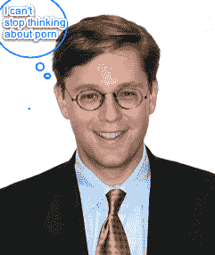

# 即将离任的 FCC 主席想要清除无线网络中的色情内容。祝你好运。TechCrunch

> 原文：<https://web.archive.org/web/https://techcrunch.com/2008/12/01/outgoing-fcc-chairman-wants-to-rid-the-wireless-web-of-porn-good-luck-with-that/>

# 即将离任的 FCC 主席想要清除无线网络中的色情内容。祝你好运。

在他在联邦通信委员会的领导地位日渐衰落的日子里，主席凯文·马丁试图在他给该机构留下印记的最后机会里推动一些引人注目的倡议。例如，在选举日， [FCC 批准了](https://web.archive.org/web/20230304120643/https://techcrunch.com/2008/11/04/googles-election-day-victory-fcc-approves-unlicensed-use-of-white-spaces-spectrum/)未经许可使用正在释放的空白电视频谱(又名 WiFi 2.0)。现在，马丁想要清除无线网络中的色情内容。

他计划在本月即将到来的会议上解决的问题之一，是一项让所有美国人通过电波免费访问网络的计划，不包括色情内容。成年人将能够选择回来获得原始的，未经过滤的互联网。

该提案为联邦通信委员会监管网络上的道德标准打开了大门，但只有当无线设备通过无线电波访问网络时。它将重申联邦通信委员会在这一领域的权威，这又回到了它强加于广播电视的正派标准。出于几个原因，这是一个坏主意。

**1.**

**2。这条规则只适用于一个频段，AWS-3 频段，还没有人真正使用它。这就像在光纤网络电视上禁止色情，但在卫星或有线电视上却不做任何事情。如果儿童看色情片是问题所在，这将无助于阻止它。**

**3。撇开色情过滤不谈，要求 AWS-3 频谱拍卖的获胜者放弃他们赢得的四分之一的频道来建立一个免费的低速无线互联网服务肯定会使这些频道对任何潜在的投标者来说价值更低。更糟糕的是，它可能会赶走最好的潜在投标人，他们可能会认为这不值得他们付出努力或资金。**

你不得不怀疑马丁是否真的认为他能让这个通过，或者他只是想把它作为简历的素材。如果马丁决定在未来竞选公职，这种事情在竞选活动中会发挥很好的作用。为什么他现在提出这个问题，因为它最终只是光谱的一小部分？如果他真的想根除无线网络上的色情内容，他应该在 700 MHz 频谱的最后一轮拍卖中尝试实施这种规则。但他没有。

建立一个免费的无线网络接入层是他的提议中更有趣的部分。也许一个更好的方法是为频谱赢家提供免费的服务等级，而不是强制。例如，为什么不为每一个包含免费网络接入条款的投标提供 25%的折扣，而这些条款可以由广告支持。这样，市场将会挑选出哪些部分应该免费，哪些部分应该付费。