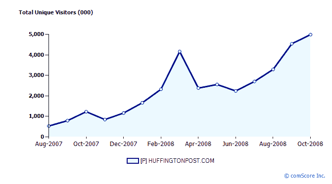

# 《赫芬顿邮报》从 Oak Investment Partners TechCrunch 融资 2500 万美元

> 原文：<https://web.archive.org/web/https://techcrunch.com/2008/12/01/the-huffington-post-raises-25-million-from-oak-investment-partners/>

我们已经知道[《赫芬顿邮报》](https://web.archive.org/web/20221006234400/http://www.huffingtonpost.com/)[正在寻找资金](https://web.archive.org/web/20221006234400/http://www.beta.techcrunch.com/2008/11/21/in-the-afterglow-of-the-election-huffpo-looks-to-raise-15-million/)，但结果比伦敦《泰晤士报》早些时候预测的 1500 万美元多一点。卡拉·斯威舍说，政治超级博客网络实际上已经从橡树投资伙伴那里筹集了 2500 万美元，并将在今天上午晚些时候宣布这一消息。

第三轮筹集的资金总额高达 3700 万美元。去年 9 月，当《赫芬顿邮报》筹集到 500 万美元的 B 轮融资时，我们想知道它值多少钱。卡拉的消息来源显示，估价“接近 1 亿美元”。拉法特·阿里最近也进行了类似的估价。

新的资本将用于招聘，以及将《赫芬顿邮报》的服务扩展到其他领域，如“商业、绿色/清洁技术和调查性新闻”。它们也为“精选和重点收购”敞开了大门。Oak Investment Partners 拥有相关的投资记录，过去曾投资过 Federated Media (TechCrunch 的广告合作伙伴)、Demand Media、MobiTV、Oberon Media 等公司。

在接受《新兴城市》采访时，Oak 的弗雷德·哈曼说:

> 随着人们越来越多地在网上获取新闻媒体，从线下到线上的转变是不可避免的，这次选举证明了《赫芬顿邮报》可以有多强大。我认为，在广告商眼中，选举后对《赫芬顿邮报》的看法已经发生了变化，它已经成为一个重要的主流新闻网站。

即将加入《赫芬顿邮报》董事会的哈曼还补充道:

> 印刷媒体的周期正在加速下行，没有多少公司有资产负债表，也没有多少公司专注于在线业务。新闻市场在很多方面都是开放的……对于那些被视为权威的人来说，这是一个好时机。

康姆斯克的博客网络流量报告似乎反映出《赫芬顿邮报》事实上做了一些正确的事情。

**更新:**这是完整的新闻稿:

*《赫芬顿邮报》宣布橡树投资伙伴*投资 2500 万美元

纽约州纽约市(2008 年 12 月 1 日)——领先的新闻和评论网站《赫芬顿邮报》今天宣布，它已从总部位于加利福尼亚州帕洛阿尔托的风险投资公司 Oak Investment Partners 获得 2500 万美元的资金。《赫芬顿邮报》(简称“赫芬顿邮报”)将利用这些收入投资于公司的增长，并进行精选和重点收购。该公司表示，将投资于其技术和基础设施，提高其内部广告能力，并继续扩大其内容供应——包括一项新的调查性新闻举措和在选定城市推出《赫芬顿邮报》的当地版本。《赫芬顿邮报》的联合创始人阿里安娜·赫芬顿和肯尼斯·勒尔宣布了这一消息。

阿里安娜·赫芬顿说:“Oak Investment Partners 的这一承诺将使我们能够加快增长，增加垂直媒体、更多视频、更多公民新闻计划、更多城市的地方版，以及调查性新闻的基金。”“我们对 Oak 的 Fred Harman 加入我们的董事会感到特别兴奋；他对新媒体领域的深入了解将帮助我们将《赫芬顿邮报》推向新的高度。”

Kenneth Lerer 说:“随着我们的发展，我们很高兴能够引入像 Oak 这样的合作伙伴，与软银资本和 Greycroft 合作。自三年半前推出该网站以来，该公司已经建立了一个强大的品牌和数百万依赖该网站获取智能新闻和观点的受众。来自 Oak 的额外资本将使我们能够全力以赴地开展业务和选择收购。”

Oak Investment Partners 的普通合伙人弗雷德·哈曼(Fred Harman)表示，“许多新闻媒体业务需要围绕广告支持的模式在网上重组，而这一时间表因经济下行周期而加速，而不是放缓。我们相信，《赫芬顿邮报》已经建立了一个平台和商业模式，成为聚合在线受众的领导者之一。我们的融资将为扩大公司规模提供必要的资源，包括通过收购其他人才和新媒体公司。我们也很高兴有机会支持 Arianna 和公司强大的创业团队。”

《赫芬顿邮报》首席执行官贝琪·摩根(Betsy Morgan)表示，“有了 Oak 的资助，《赫芬顿邮报》完全有能力建立其令人难以置信的增长。Oak 带来了一支经验丰富、见解深刻的团队，我们期待与他们合作，抓住我们面前的机遇。”

C 轮融资正值《赫芬顿邮报》在 2007 年网站扩张后继续经历显著增长，当时《赫芬顿邮报》开始推出各种新板块，包括娱乐、政治、媒体、生活、时尚和绿色。该网站还推出了第一个本地版本《赫芬顿邮报芝加哥》。今年,《赫芬顿邮报》因其对 2008 年总统竞选的原创报道而受到广泛关注，包括其公民记者 OffTheBus 团队提供的报道。《赫芬顿邮报》目前有 46 名员工。

哈曼加入《赫芬顿邮报》董事会，董事会成员包括:软银资本管理合伙人埃里克·希波、阿里安娜·赫芬顿、肯尼斯·勒勒和贝琪·摩根。